# Unravel — System Architecture

## Core Concept

Unravel reverses the standard AI debugging loop. Most AI tools pattern-match symptoms against a statistical model of code. Unravel extracts deterministic ground truth from the code *first*, then forces the AI to eliminate hypotheses using that evidence — not guess at explanations from the symptom alone.

**The architectural thesis:** A language model cannot hallucinate about a fact that has been proven to it. If the prompt contains "AST-verified: `duration` is written at line 69 inside `pause()`," the model cannot claim `duration` is never mutated. Verified context eliminates entire classes of hallucinatory reasoning before they occur.

---

## Pipeline Overview

```mermaid
flowchart TD
    Input([<b>Input</b><br/>Local Files · Paste · GitHub URL]) --> L0

    subgraph L0 ["Layer 0: Deterministic AST Analysis"]
        direction TB
        A1["<b>tree-sitter WASM</b><br/><i>Primary Engine (Deterministic)</i><br/>──────────────────────<br/>• Variable mutation chains<br/>• Closure captures + stale closure detection<br/>• Async boundaries + floating promise detection<br/>• React-specific patterns (useState · useEffect)<br/>• Cross-file import/export resolution<br/>• Object property mutation detection"]
    end

    L0 -->|Verified Context| L1

    subgraph L1 ["Layer 1: Graph-Frontier Router"]
        direction TB
        B1["<b>BFS Search</b> over import + call + mutation graph<br/><i>Phase 0.5 Context Selection</i><br/>──────────────────────<br/>• <b>Debug</b>: 5–8 files near symptom<br/>• <b>Explain</b>: 15–25 files for breadth<br/>• <b>Security</b>: 8–12 files on attack surface"]
    end

    L1 -->|Code Slices + AST Facts| L2

    subgraph L2 ["Layer 2: Core Engine"]
        direction TB
        C1["<b>8-Phase Pipeline</b><br/><i>Single LLM Call (Context-Loaded)</i><br/>──────────────────────<br/>• Anti-sycophancy guardrails (7 rules)<br/>• Evidence-backed confidence score<br/>• Progressive streaming via SSE<br/>• Mode-specific output schema"]
    end

    L2 --> L3

    subgraph L3 ["Layer 3: Verification Layer"]
        direction TB
        D1["<b>Claim Verifier</b><br/>• Citation Verification (file/line exist)<br/>• Reject fabricated variable references<br/>• Hard-block degraded responses<br/><b>Fix Completeness Verifier</b><br/>• Cross-reference fix vs call graph<br/>• Flag callers of modified functions<br/>• Penalize confidence by 0.15 per miss"]
    end

    L3 --> Out([<b>Final Output</b><br/>Structured JSON Report<br/>Web App · VS Code Sidebar])

    %% Styling
    style Input fill:#0d1117,stroke:#58a6ff,stroke-width:2px,color:#fff
    style Out fill:#0d1117,stroke:#58a6ff,stroke-width:2px,color:#fff
    style A1 fill:#0d1117,stroke:#30363d,color:#c9d1d9
    style B1 fill:#0d1117,stroke:#30363d,color:#c9d1d9
    style C1 fill:#0d1117,stroke:#30363d,color:#c9d1d9
    style D1 fill:#0d1117,stroke:#30363d,color:#c9d1d9
    style L0 fill:#161b22,stroke:#30363d,color:#8b949e
    style L1 fill:#161b22,stroke:#30363d,color:#8b949e
    style L2 fill:#161b22,stroke:#30363d,color:#8b949e
    style L3 fill:#161b22,stroke:#30363d,color:#8b949e
```

---

## The 8-Phase Reasoning Pipeline

The LLM is forced through these phases in strict sequence. It cannot skip to conclusions.

| Phase | Name | Constraint |
|------:|------|------------|
| 1 | **Read** | Ingest every file completely. No hypotheses yet. |
| 2 | **Understand Intent** | For each function/module: what is it *trying* to do? |
| 3 | **Symptom Mapping** | What observable behavior is failing? What is the exact failure event? |
| 4 | **AST Fact Injection** | Accept verified mutation chains, closures, async boundaries as ground truth. |
| 5 | **Hypothesis Generation** | Generate 3 mutually exclusive, non-overlapping explanations. |
| 6 | **Hypothesis Elimination** | Kill any hypothesis the AST evidence contradicts. Quote the exact line. |
| 7 | **Concept Extraction** | What programming concept does this bug teach? |
| 8 | **Invariants** | What conditions must hold for this code to be correct? |

---

## Three Environments

Unravel operates across three linked environments sharing a single core engine.

### 1. The Core Engine (`src/core/`)

The analytical brain. Zero React, browser, or VS Code dependencies.

| File | Responsibility |
|------|---------------|
| `orchestrate.js` | Full pipeline as a single async function. Houses the claim verifier and fix completeness verifier. |
| `ast-engine-ts.js` | tree-sitter WASM analysis — mutation chains, closure captures, async boundaries, React patterns, floating promises. |
| `ast-project.js` | Cross-file module map, symbol origins, call graph construction, mutation chain merging, graph-frontier BFS router. |
| `provider.js` | `callProvider()` + `callProviderStreaming()`. Anthropic, Google, OpenAI. Exponential backoff retry. |
| `config.js` | Model configs, anti-sycophancy rules, 8-phase system prompt, output schemas, bug taxonomy. |
| `parse-json.js` | Battle-hardened JSON parser — handles markdown fences, partial outputs, balanced brace extraction. |
| `index.js` | Barrel export. |

### 2. The Web App (`unravel-v3/`)

React/Vite application. Handles user inputs (folder upload, paste, GitHub URL import), wraps the core engine, provides the Action Center.

### 3. The VS Code Extension (`unravel-vscode/`)

Brings Unravel into the IDE. Resolves local workspace imports natively, pipes data to the Core Engine, and renders output using split-pane diffs, inline overlays, hover tooltips, and a Webview sidebar.

> **Sync Rule:** If you modify the Core Engine in `unravel-v3/src/core/`, sync the changes to `unravel-vscode/src/core/`. The Core Engine is duplicated across clients to maintain zero cross-environment dependencies.

---

## Layer 0 — AST Engine in Depth

The `ast-engine-ts.js` module runs tree-sitter WASM natively in the browser and in Node.js. Key subsystems:

**`extractMutationChains(tree)`** — Walks every assignment and update expression. Records variable name, line number, enclosing function, and direction (write/read). Handles destructuring patterns and object property mutations (`task.status = newStatus`).

**`trackClosureCaptures(tree)`** — For each function scope, uses tree-sitter S-expression queries to identify identifiers that are referenced inside the function but bound in an outer scope. These are stale closure candidates — the #1 hardest bug class in JavaScript.

**`findTimingNodes(tree)`** — Maps every async boundary: `setTimeout`, `setInterval`, `addEventListener`, `fetch`, Promise chains. Explicit mapping prevents the model from incorrectly describing async execution as sequential.

**`detectFloatingPromises(tree)`** — Uses the `isAwaited(node)` guard: walks the AST upward from an async call. If it reaches an `await_expression` before hitting a statement boundary, the call is awaited. If it hits `expression_statement` first, it is floating — a common silent failure mode.

**`detectReactPatterns(tree)`** — Detects three React-specific anti-patterns: `setState` called inside callbacks without the relevant state variable in the dependency array (stale closure in React), `useEffect` with side effects but no cleanup return, and missing dependency array entries in `useMemo`/`useCallback`.

**Error threshold:** Parse errors above 5 per file surface a warning. tree-sitter's partial-parse resilience means files with syntax errors still yield useful facts rather than failing entirely.

---

## Layer 3 — Verification in Depth

The claim verifier runs after every LLM response before it reaches the UI. It performs six checks:

1. Root cause file exists in the provided inputs
2. Cited line number is within bounds of the cited file
3. Named variable or function exists in the AST
4. Referenced import/export exists in the cross-file module map
5. Security vulnerability location file exists
6. Fix completeness — every function modified in `minimalFix` has all its callers mentioned in the fix

Failures above a threshold force `needsMoreInfo: true` and trigger a recursive re-call with an expanded request for context. This is the self-healing context loop. Hard failures (fabricated root cause file, zero AST evidence for the root cause) block the response entirely rather than showing a degraded result.

---

## Key Design Principles

1. **Deterministic facts before AI reasoning.** tree-sitter runs first. The model receives verified ground truth.
2. **Evidence required for every claim.** No bug report without exact line and code fragment.
3. **Eliminate wrong hypotheses, don't guess at right ones.** Generate three, kill what the evidence contradicts.
4. **Never hide uncertainty.** Uncertain is better than confident-wrong.
5. **Optimize for developer understanding, not impressive output.** Insight over length.
