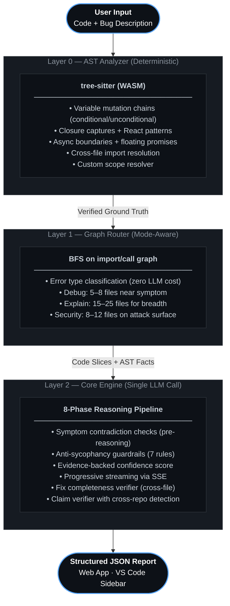

<div align="center">


<br/>

<video src="https://github.com/EruditeCoder108/UnravelAI/blob/main/assets/demo.mp4?raw=true" width="100%" autoplay loop muted playsinline></video>

<br/>

<h1>Stop letting your AI guess.</h1>

<p>
<b>Unravel</b> runs a static AST analysis pass before any LLM sees your code.<br/>
Every mutation chain. Every async boundary. Every closure capture — verified and injected as ground truth.<br/>
<br/>
<em>No more symptom-chasing. No more hallucinated fixes. Just exact root causes.</em>
</p>

<br/>

[](https://github.com/EruditeCoder108/UnravelAI)
[](#benchmark)

[]()
[]()
[]()
[](#language-support)
[](LICENSE)
[](https://vibeunravel.netlify.app)

<br/>

**[Try it now →](https://vibeunravel.netlify.app)** &nbsp;&nbsp;·&nbsp;&nbsp; **[Architecture →](ARCHITECTURE.md)** &nbsp;&nbsp;·&nbsp;&nbsp; **[Benchmark →](#benchmark)**

</div>

## Table of Contents

- [How It Works](#how-it-works)
- [The Loop Every Developer Knows](#the-loop-every-developer-knows)
- [The Unravel Difference](#the-unravel-difference)
- [Proved in the Wild](#proved-in-the-wild)
- [Getting Started](#getting-started)
- [Why AI Debugging Usually Fails](#why-ai-debugging-usually-fails)
- [Architecture](#architecture)
- [Three Modes](#three-modes)
- [The 8-Phase Pipeline](#the-8-phase-pipeline)
- [Anti-Sycophancy Guardrails](#anti-sycophancy-guardrails)
- [Fix Completeness Verifier](#fix-completeness-verifier)
- [Diagnosis Verdicts](#diagnosis-verdicts)
- [Benchmark](#benchmark)
- [Language Support](#language-support)
- [Output Presets](#output-presets)
- [Supported Models](#supported-models)
- [Bug Taxonomy](#bug-taxonomy)
- [Design Principles](#design-principles)
- [Project Status](#project-status)
- [Contributing](#contributing)
- [License](#license)
<br/>

## How It Works


Unravel turns your code into verified facts first, then forces the AI to reason over those facts — instead of guessing from your description.

<br/>

## The Loop Every Developer Knows

You paste a bug. The AI writes a patch. The patch breaks something else. You paste the new error. The AI forgets the original context. You add more explanation. It hallucinates a function that doesn't exist. You correct it. It apologizes and suggests the same fix it gave you three messages ago.

**You are now the AI's QA tester.**

This isn't a model quality problem. It's a *context* problem. The model never knew what your code actually does — it was pattern-matching from your description, not from the code itself. It saw a `TypeError` and suggested type fixes. It never asked: *where did the data first go wrong?*

<br/>

## The Unravel Difference

Before any model sees your code, Unravel's AST engine runs a deterministic analysis pass. It extracts every variable mutation, every closure capture, every async boundary, every cross-file import chain, every React hook dependency gap — as **verified facts**. These become ground truth injected into the prompt. The model cannot hallucinate about what doesn't exist. It cannot guess. It must trace.

The result: **exact file, exact line, exact variable, with evidence and a confidence score.**

<br/>

## Proved in the Wild

Before any formal benchmark, Unravel has already been used to diagnose and fix bugs in real production repositories — with the fixes merged and issues closed.

<details>
<summary><b>▸ &nbsp; cal.com #28283 — Settings toggles blocking each other (closed)</b></summary>

<br/>

**The report:** Toggle switches on the Settings page (e.g. "Search engine indexing", "Monthly digest") were not independent. Clicking one caused all others to show a `not-allowed` cursor and become unresponsive until the first API call completed.

**What Unravel found:** A single `trpc.viewer.me.updateProfile.useMutation` hook at `general-view.tsx L44` was shared across all toggles. The global `isUpdateBtnLoading` state set at `L184` before `mutation.mutate` — and reset at `L87` on `onSettled` — was propagated to the `disabled` prop of every `SettingsToggle` in the form. The execution timeline traced T0 (click) → T0+δ (`isUpdateBtnLoading = true`, all toggles disabled) → T1 (second toggle unresponsive) → T2 (API resolves, `isUpdateBtnLoading = false`).

**The fix:** Create a separate `useMutation` hook per toggle, so each toggle's `disabled` prop binds only to its own `isPending` state. Optimistic updates flip the UI instantly. The main form save button retains its own mutation and dirty-state guard.

**What happened:** The fix pattern was implemented directly in [PR #28296](https://github.com/calcom/cal.com/pull/28296), which was merged and closed the issue. The reporter credited Unravel by name in the thread.

</details>

<details>
<summary><b>▸ &nbsp; tldraw #8148 — create-tldraw CLI installing into current directory (closed)</b></summary>

<br/>

**The report:** `npm create tldraw my-app` installed everything into the current directory instead of creating a `my-app/` subdirectory. A second bug: files were created even after the user cancelled the "Directory is not empty" prompt.

**What Unravel found:** `targetDir` was set from `process.cwd()` *before* the interactive `namePicker` prompt ran. The name entered interactively was only used to write the `name` field in `package.json` — it never updated `targetDir`. The data flow went: `args._[0]` → `maybeTargetDir` → `targetDir = maybeTargetDir ?? process.cwd()` → `namePicker(maybeTargetDir)` → name used for `package.json` only. For bug 2, static analysis showed `ensureDirectoryEmpty` calls `process.exit(1)` on cancel — the "files created" reports were from external npm scaffolding running before Unravel's code, not from the tool's post-cancel path.

**The fix:** After `namePicker` returns, check if no argument was given *and* the user entered a name different from `pathToName(process.cwd())` — if so, resolve a new `targetDir` from that name before calling `ensureDirectoryEmpty`. This is exactly the `// START FIX` block committed in [PR #8161](https://github.com/tldraw/tldraw/pull/8161), which was merged and closed the issue.

</details>

<br/>

## Getting Started

### Web App — No install required

Visit **[vibeunravel.netlify.app](https://vibeunravel.netlify.app)**

1. Enter your API key (Anthropic, Google, or OpenAI)
2. Upload project files, paste code, or import a GitHub URL
3. Describe the bug symptom
4. Select Debug, Explain, or Security mode
5. Read the diagnosis

### VS Code Extension

The extension is currently in development and not yet published to the Marketplace. To use it locally:

```bash
git clone https://github.com/EruditeCoder108/UnravelAI.git
cd UnravelAI
npm install
npm run build:extension
```

Install the generated `.vsix` via **Extensions → Install from VSIX** in VS Code.

### Run Locally

```bash
git clone https://github.com/EruditeCoder108/UnravelAI.git
cd UnravelAI
npm install
npm run dev
```

<br/>

<br/>

## Why AI Debugging Usually Fails

Most LLM debugging tools fail for a simple reason: **they reason about text instead of code state.**

When you describe a bug, the model sees your words — not your program's execution path. It pattern-matches against training data. It sees `TypeError: undefined is not a function` and suggests type fixes. It sees "timer is wrong after pause" and guesses stale closures. It never asks the question that actually matters: *where was state first corrupted?*

Debugging is fundamentally about **state transitions** — which variable changed, in which function, at which line, and what downstream reads got the corrupted value. That information lives in the code, not in your description of the code. No amount of prompt engineering extracts it.

Unravel solves this by running a deterministic AST pass first and extracting the state facts directly:

- **Where variables mutate** — every write, by function, by line, flagged conditional vs. unconditional
- **Where async boundaries occur** — every `setTimeout`, `setInterval`, `addEventListener`, floating promise
- **Where closures capture stale state** — every inner function reading an outer scope binding
- **How data flows across files** — every import chain, every cross-file call

Only after these facts exist does the model reason. It cannot contradict them. It cannot hallucinate a mutation that isn't there. It must trace state backwards from the failure point to where it was first corrupted — or say it cannot confirm.

> A real Pomodoro timer bug. Same model. Same code. Two contexts.

<table>
<thead>
<tr>
<th width="50%">❌ &nbsp; Standard ChatGPT / Claude</th>
<th width="50%">✅ &nbsp; Unravel + Claude</th>
</tr>
</thead>
<tbody>
<tr>
<td>

```
"This looks like a race condition or a 
stale closure. Try adding a .catch() 
block or wrapping the reset logic in 
a setTimeout to let state settle."
```

> Confident. Plausible. **Wrong.**

</td>
<td>

```
AST VERIFIED — script.js

duration: MUTATED at pause() L69 ⚠ [CONDITIONAL]
  written: pause() L69, setMode() L86
  read:    tick() L55, reset() L79

Root Cause: duration is a config 
variable being overwritten as runtime 
state. reset() at L79 reads the already-
corrupted value.

Fix: Remove mutation at L69.
Add lastActiveRemaining for pause state.

--- script.js L69
-    duration = remaining
+    lastActiveRemaining = remaining

Confidence: 0.94
```

> Traced. Evidenced. **Exact.**

</td>
</tr>
</tbody>
</table>

<br/>


<br/>

## Architecture



<br/>

<details>
<summary><b>▸ &nbsp; Step-by-step: How Unravel processes a request</b></summary>

<br/>

**Step 1 — Input arrives.**
User uploads files and describes the bug. Unravel immediately checks every file for truncation signals (unbalanced braces, missing closing tags) and injects completeness warnings if anything looks cut off. A deterministic error-type classifier (`classifyErrorType`) categorises the symptom as `PACKAGE_RESOLUTION`, `BUILD_CONFIG`, `RUNTIME_TYPE`, or `RUNTIME_LOGIC` — before any LLM call — so the routing and verifier stages apply the right heuristics for that category.

**Step 2 — Graph Router trims the search space.**
If more than 15 files are provided, a BFS traversal of the import/call graph selects only the files most likely to contain the root cause. Debug mode focuses on 5–8 files around the symptom. Explain mode reads 15–25 for architectural breadth. Security mode follows the attack surface. A two-pass router additionally checks content summaries of the first pass and auto-fetches any missing dependency files.

**Step 3 — AST engine runs deterministically.**
tree-sitter (WASM) walks every JS/TS file and extracts: all variable mutation chains (every write/read, by function, by line), whether each mutation is on a conditional or unconditional code path (`[CONDITIONAL]` tag), all closure captures and stale closure candidates, all async boundaries and floating promises, all React hook patterns. A second cross-file pass builds the import/call graph and identifies functions called across file boundaries.

**Step 4 — Symptom contradictions are checked.**
Before the model reasons, the AST facts are compared against the user's symptom. If the user says "event not firing" but AST confirms `addEventListener` is wired, that contradiction is injected as an explicit alert. If the user names a function that only reads state (no writes), it's flagged as a crash site, not a root cause. These pre-reasoning challenges prevent the model from being misled by inaccurate bug reports.

**Step 5 — Ground truth is injected.**
The AST output is framed as verified facts the model cannot contradict. Every mutation (with conditional context), every boundary, every closure — exact file and line. The model is explicitly told: *do not contradict these.*

**Step 6 — The 8-phase pipeline runs.**
One LLM call. The model is forced through: Read → Understand Intent → Understand Reality (3 mutually exclusive hypotheses) → Build Context → Diagnose (eliminate hypotheses by quoting exact AST evidence) → Minimal Fix (with unified diff) → Concept Extraction → Invariants. It cannot skip to a conclusion.

**Step 7 — The claim verifier cross-checks the output.**
Every file reference and line number in the model's response is verified against the actual files. A symptom whitelist ensures files mentioned in the original error message are never mis-flagged as hallucinations. If a cited file belongs to an external package rather than the scanned repo, it's tagged as a cross-repo reference (not rejected). Fabricated references trigger confidence penalties. A fabricated root cause triggers a hard rejection and a retry.

**Step 8 — Fix completeness check.**
The cross-file call graph (already built in Step 3) is checked against the proposed fix. If the fix modifies a function in file A but ignores file B which calls it, a warning is injected and confidence is penalized. React component files are exempt — they're leaf consumers, not callers that need updating.

**Step 9 — Verdict is determined.**
The engine returns one of three structured verdicts: a normal diagnosis report, a `LAYER_BOUNDARY` verdict if the bug is upstream of all provided code (OS, browser native layer, third-party runtime), or an `EXTERNAL_FIX_TARGET` verdict if the diagnosis is correct but the fix must be applied in a different repository. Each verdict carries the full provenance chain.

</details>

<br/>


<br/>

## Three Modes

<table>
<tr>
<td width="33%" align="center">

### 🐛 &nbsp; Debug
**Root cause diagnosis**

Full 8-phase pipeline. Traces state backwards from the symptom through mutation chains to the exact corruption point.

Returns: root cause · evidence · unified diff fix · confidence · Mermaid diagrams

*Best for: production bugs, async races, cross-file state corruption, anything that resisted multiple AI attempts.*

</td>
<td width="33%" align="center">

### 🔍 &nbsp; Explain
**Architecture walkthrough**

Reads 15–25 files for breadth. Maps module responsibilities, data flow direction, entry points, and dependency graph.

Returns: module map · data flow · dependency graph · onboarding guide

*Best for: onboarding to a new codebase, pre-refactor mapping, understanding legacy code.*

</td>
<td width="33%" align="center">

### 🛡️ &nbsp; Security
**Vulnerability audit**

Traces attack surface across 8–12 files. Requires a concrete exploit payload — no vague "could be vulnerable" claims.

Returns: vulnerability type · attack vector · proof-of-exploit · severity · remediation

*Best for: pre-deploy audits, user-input chains, third-party dependency reviews.*

</td>
</tr>
</table>

<br/>


<br/>

## The 8-Phase Pipeline

The model is forced through these phases in sequence. It cannot skip to conclusions.

| Phase | Name | What Happens |
|------:|------|--------------|
| 1 | **Read** | Read every file completely. No opinions yet. |
| 2 | **Understand Intent** | For each function and module: what is it *trying* to do? |
| 3 | **Understand Reality** | What is the code actually doing? Generate exactly 3 mutually exclusive hypotheses for any divergence. |
| 4 | **Build Context** | Map dependencies and boundaries. Use AST ground truth — do not contradict it. |
| 5 | **Diagnose** | Test each hypothesis against AST evidence. Kill contradicted ones. Quote the exact AST line that eliminates each — no citation, no elimination. |
| 6 | **Minimal Fix** | Smallest surgical change, with unified diff (`--- file L69 / - old / + new`). Architectural note added only for structural root causes. |
| 7 | **Concept Extraction** | What programming concept does this bug teach? |
| 8 | **Invariants** | What conditions must hold for correctness? |

<br/>


<br/>

## Anti-Sycophancy Guardrails

Every AI debugger has the same failure mode: it agrees with you. You say "race condition," it finds a race condition — whether or not one exists. Unravel has seven hardcoded rules that the model cannot override.

> **Rule 1** — If the code is correct, say *"No bug found."* Do not invent problems.

> **Rule 2** — If the user's description contradicts the code, point out the contradiction.

> **Rule 3** — If uncertain, say *"Cannot confirm without runtime execution."*

> **Rule 4** — Every bug claim must cite exact line number + code fragment as proof.

> **Rule 5** — Never describe code behavior that cannot be verified from provided files.

> **Rule 6** — The crash site is never the root cause. It is the symptom. Trace state backwards through mutation chains from the failure point. The root cause is where state was *first* corrupted.

> **Rule 7** — A variable named `isPaused` does not guarantee the code is paused. A function named `cleanup()` does not guarantee cleanup occurs. Verify behavior from the execution chain, not naming conventions.

Rules 6 and 7 were added from research analysis. Rule 6 guards against *proximate fixation* — LLMs blaming the crash site instead of the distant corruption. Rule 7 guards against the *name-behavior fallacy* — LLMs trusting variable semantics over actual execution paths.

<br/>


<br/>

## Fix Completeness Verifier

After the model proposes a fix, Unravel cross-references it against the AST call graph built during Layer 0. If the fix modifies a function in file A but fails to update file B which calls that function, the verifier automatically:

- Penalizes the confidence score by `0.15`
- Injects a warning into the `uncertainties` block:
  `AST Guard: Fix modifies 'X' but misses updates to downstream caller 'Y'`

React component files (`.jsx`, `.tsx`, PascalCase filenames) are exempt — they're leaf consumers, and a correct hook or utility fix doesn't require touching every component that uses it.

No extra LLM calls. Zero added latency. Uses data already computed during analysis.

<br/>


<br/>

## Diagnosis Verdicts

Every analysis concludes with one of three structured verdicts.

**Normal diagnosis** — The bug is in the provided codebase. Returns `rootCause`, `minimalFix`, unified `diffBlock`, `hypothesisTree` with per-hypothesis `eliminatedBy` citations, `evidence[]`, `confidence`, and Mermaid edge data.

**`LAYER_BOUNDARY`** — The root cause is upstream of all provided code: in the OS, the browser's native event system, a runtime, or a third-party native layer. The engine refuses to generate a patch that would be wrong by construction. Returns `rootCauseLayer`, `reason`, and `suggestedFixLayer` so the user knows exactly where to look.

**`EXTERNAL_FIX_TARGET`** — The diagnosis is correct and the bug is real, but the fix must be applied in a *different repository*. Triggered when the model cites a file that belongs to a dependency package rather than the scanned repo. Returns the full diagnosis alongside `targetRepository`, `targetFile`, and `suggestedAction`. The user gets the complete root cause and knows exactly which repo to apply it in.

<br/>


<br/>

## Benchmark

Unravel's edge is not on easy, isolated bugs — any modern LLM handles those adequately. This engine is built for the opposite scenario: large repos, deep cross-file mutation chains, async races across multiple files, bugs where the symptom and root cause live in completely different modules.

| Suite | Status | Model | Signal |
|-------|--------|-------|--------|
| 2 merged PRs (tldraw #8161, cal.com #28296) | ✅ Validated | Gemini 2.5 Flash | Primary validation — diagnoses used by maintainers, fixes merged |
| UDB-11 (11 bugs) | 📌 Sidelined | Gemini 2.5 Flash | Early architectural signal only: +9% RCA, −35% hallucination. Not publication data. |
| UDB-51 (51 bugs, 8 categories) | ⏸ Paused | — | Superseded by real-world PR validation as primary evidence path |
| 20 real GitHub issues | 📋 Planned | Multi-model | Next.js, React, Vite, Express — vs. actual merged fixes |

**Target:** ≥85% RCA accuracy on hard bugs · ≥+10% delta over raw baseline · <5% hallucination rate

> The merged PRs are the primary correctness signal: real production bugs in major repositories, diagnosed correctly, with maintainer acceptance as the external validation. UDB-11 is early supporting evidence. UDB-51 is deferred — real-world validation is the more meaningful path and is already underway.

<br/>

## Language Support

AST analysis currently supports **JavaScript · TypeScript · JSX · TSX**. More languages are coming — Python, Go, and Rust are next on the roadmap. The 8-phase pipeline and all three modes work for any language via the LLM layer today; AST ground truth extraction is JS/TS-only for now.

<br/>


<br/>

## Output Presets

| Preset | What You Get |
|--------|-------------|
| **Quick Fix** | Root cause + fix only. Read in 30 seconds. |
| **Developer** | Root cause + fix + evidence + confidence score. |
| **Full Report** | All sections: hypothesis elimination, per-phase trace, all Mermaid diagrams. |
| **Custom** | Per-section checkboxes. Build exactly the report you need. |

Every Full Report includes auto-generated Mermaid diagrams: Timeline · Hypothesis Tree · Data Flow · Dependency Graph · Variable State · Attack Vector *(Security mode)*

<br/>


<br/>

## Supported Models

Any LLM you already have API access to. Your key. Your model. No data sent to Unravel servers.

| Provider | Models |
|----------|--------|
| **Anthropic** | Claude Opus 4.6 · Claude Sonnet 4.6 · Claude Haiku 4.5 |
| **Google** | Gemini 2.5 Flash · Gemini 3 Flash · Gemini 3.1 Pro |
| **OpenAI** | GPT-5.3 Instant |

<br/>


<br/>

## Bug Taxonomy

Every diagnosis is classified across 12 formal categories:

```javascript
const BUG_TAXONOMY = {
  STATE_MUTATION:  "Variable meant to be constant is modified unexpectedly",
  STALE_CLOSURE:   "Function captures outdated variable value",
  RACE_CONDITION:  "Multiple async operations conflict on shared state",
  TEMPORAL_LOGIC:  "Timing assumptions break (drift, wrong timestamps)",
  EVENT_LIFECYCLE: "Missing cleanup, double-binds, or wrong event order",
  TYPE_COERCION:   "Implicit type conversion causes unexpected behavior",
  ENV_DEPENDENCY:  "Code behaves differently across environments",
  ASYNC_ORDERING:  "Operations execute in wrong sequence",
  DATA_FLOW:       "Data passes incorrectly between components or files",
  UI_LOGIC:        "Visual behavior does not match intent",
  MEMORY_LEAK:     "Resources not released, accumulate over time",
  INFINITE_LOOP:   "Recursive or cyclic behavior creates runaway effect",
};
```

## Design Principles

> **1. Deterministic facts before AI reasoning.**
> The AST pass runs first. The model receives verified ground truth, not a blank canvas.

> **2. Evidence required for every claim.**
> No bug report without exact line number and code fragment. No exceptions.

> **3. Eliminate wrong hypotheses — don't guess at right ones.**
> Generate multiple explanations, then kill the ones the evidence contradicts. The survivor is the diagnosis.

> **4. Never hide uncertainty.**
> *Uncertain* is better than *confident-wrong.* If two of three hypotheses survive elimination, say so.

> **5. Optimize for developer understanding, not impressive output.**
> The goal is insight. Not a longer report.

<br/>

## Project Status

```
Phase 1    ✅  Web app, 8-phase pipeline, multi-provider, anti-sycophancy (7 rules)
Phase 2    ✅  AST pre-analysis, open source
Phase 3    ✅  Core engine extracted, VS Code extension (v0.3.0) end-to-end
Phase 3.5  ✅  Pre-publish hardening (MemberExpression detection, input completeness)
Phase 3.6  ✅  File handling hardening (Router-first GitHub, empty symptom support)
Phase 4A   ✅  Multi-mode analysis (Debug / Explain / Security) + output presets
Phase 5    ✅  GitHub Issue URL parsing, Action Center (Web + VS Code)
Phase 4B   ✅  Intelligence layer — complete:
               ✅  Cross-file AST import resolution (ast-project.js)
               ✅  Graph-frontier deterministic router (BFS, wired as Phase 0.5)
               ✅  Progressive streaming (SSE, all 3 providers)
               ✅  Tree-sitter primary engine — Babel removed
               ✅  Floating promise detection (isAwaited guard)
               ✅  React-specific AST patterns (useState, useEffect, useMemo/useCallback)
               ✅  Fix completeness verifier (cross-file call graph guard)
               ✅  proximate_crash_site field + Variable Trace UI
               ✅  Prompt hardening (Rule 6, Rule 7, buggy context warning, mutual exclusivity)
               ✅  CFG branch annotation — conditional vs. unconditional per mutation
               ✅  Hypothesis elimination scoring — eliminatedBy field, AST citation required
               ✅  Symptom contradiction checks — listener gap, crash site ≠ root cause
               ✅  Visual diff output — unified diffBlock field in every fix
Phase 5.5  ✅  Pipeline hardening (post-arxiv) — error type classifier, cross-repo verdict,
               verifier whitelist, LAYER_BOUNDARY false-positive fix, discipline rules,
               EXTERNAL_FIX_TARGET verdict, framework name stop-list (11 fixes total)
Phase 8    📋  UDB-51 benchmark — 51 bugs, 8 categories, multi-model
Phase 9    📋  Real-world validation — 20 real GitHub issues, API pitch data
Phase 10   📋  Unravel Heavy — multi-agent parallel analysis
```

<br/>

## Contributing

See [CONTRIBUTING.md](CONTRIBUTING.md). Bug reports, new benchmark bugs, and prompt improvement proposals are especially welcome.

## License

BSL 1.1 — see [LICENSE](LICENSE).

<br/>

<div align="center">

**Built by [Sambhav Jain](https://github.com/EruditeCoder108)**

*If Unravel found a bug your AI missed — a star helps.*

</div>
