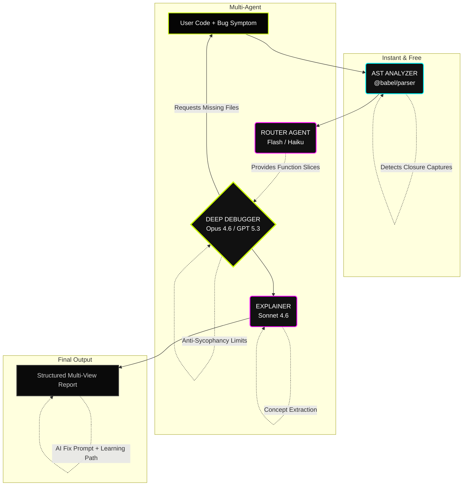

<div align="center">
  
  <h1>UNRAVEL</h1>
  <h3>The Deterministic Debug Engine</h3>
  <p>
    <em>AI Code Generation is solved. AI Code <b>Understanding</b> is not.</em><br/>
    <em>Every AI tool can write code. None of them can reliably explain why it broke.</em><br/>
    <b>Unravel fixes that.</b>
  </p>
</div>

---

## 💥 The Problem

You paste buggy code into ChatGPT. It says *"try adding a null check."* You do. It breaks something else. You paste again. It says *"ah, try wrapping it in a try-catch."* Three hours later, you've applied 14 patches and the original bug is still there.

This is the **AI debugging loop** — and every developer has been stuck in it.

The reason it happens: current AI tools **pattern-match symptoms**. They never trace root causes. They never track variable mutations. They never simulate execution flow. They just *guess* — confidently.

Unravel doesn't guess.

> **v1 Launch Scope:** Unravel currently supports **JavaScript and TypeScript** only. The AST pre-analysis relies on `@babel/parser`. Support for Python and other languages is planned for future phases.

---

## ⚙️ How It Works

Unravel runs your code through an **8-phase deterministic pipeline** — the same systematic process a senior engineer uses, but faster:

```text
Phase 1  INGEST          Read all code. Build complete mental model. No theories yet.
Phase 2  TRACK STATE     Map every variable: where declared, where read, where mutated.
Phase 3  SIMULATE        Mentally execute the user's exact sequence of actions.
Phase 4  INVARIANTS      What conditions MUST hold? Which are violated?
Phase 5  ROOT CAUSE      Identify the exact file, line, variable, and function.
Phase 6  MINIMAL FIX     Smallest surgical change. Not a rewrite.
Phase 7  AI LOOP         Why do ChatGPT / Cursor / Copilot fail on this specific bug?
Phase 8  CONCEPT         What programming concept does this bug teach?
```

Every phase builds on the last. The model cannot skip to conclusions.

---

## 🏗 Architecture



---

## What Makes It Different

|   | ChatGPT / Copilot | Unravel |
|---|-------------------|---------|
| **Analysis Method** | Pattern match the symptom, guess a fix | 8-phase deterministic pipeline with state tracking |
| **Context Handling** | Dumps entire files into context | Function-level AST slicing — only relevant code reaches the model |
| **Hallucination** | Invents plausible-sounding bugs freely | Anti-Sycophancy guards: every claim must cite exact line + code evidence |
| **Confidence** | "I think the issue might be..." | Evidence-backed: lists what was verified and what remains uncertain |
| **Fix Quality** | Rewrites the entire file | Minimal surgical fix — smallest change that resolves the root cause |
| **Teaching** | "Here's the fix, good luck" | Concept extraction: what broke, why, and how to never do it again |
| **AI Awareness** | No self-reflection | "Why AI Loops" — explains exactly why other AI tools fail on this bug |
| **Bug Classification** | Free-text description | Formal 12-category taxonomy with structured metadata |
| **Uncertain Bugs** | Picks one answer, confidently wrong | Adversarial dual-agent debate — surfaces multiple hypotheses with evidence for each |

---

## Anti-Sycophancy Engine

Most AI tools have a fatal flaw: they will **invent bugs that don't exist** just to appear helpful. If you say "I think the error is on line 10," they'll agree — even if line 10 is perfectly fine.

Unravel's engine has 5 hardcoded guards against this:

```
1. If the code is correct, say "No bug found." Do NOT invent problems.
2. If the user's description contradicts the code, point out the contradiction.
3. If uncertain, say "Cannot confirm without runtime execution."
4. Every bug claim must cite exact line number + code fragment as proof.
5. Never make up code behavior that cannot be verified from provided files.
```

If the model can't point to evidence, it doesn't claim the bug. Period.

---

## AST Pre-Analysis

Before any AI model sees the code, Unravel runs a **deterministic static analysis** in the browser using `@babel/parser`. This produces a verified context map:

```
Relevant Functions:
  start(), pause(), tick(), setMode()

Variable Mutation Chains:
  duration
    written: pause() L69, setMode() L86
    read:    tick() L55, start() L42

Async / Timing Nodes:
  setInterval  → tick()       [L57]
  addEventListener("visibilitychange") → handler() [L110]

Closure Captures:
  tick()    captures → duration, remaining, interval
  handler() captures → isPaused, interval
```

This is injected into the prompt as **verified ground truth**. The AI cannot hallucinate about what variables exist or where they're mutated — the AST already told it.

### The Impact of AST Context (Benchmark)

We measured Root Cause Analysis (RCA) accuracy across a suite of 10 complex frontend bugs (stale closures, race conditions, react rendering loops) using Gemini 2.5 Flash, with and without AST pre-analysis.

| Bug Category | Baseline RCA | AST-Enhanced RCA |
|---|---|---|
| `STALE_CLOSURE` (setInterval) | ❌ Failed | **1.0** (Exact Match) |
| `STATE_MUTATION` (Timer) | ❌ Failed | **1.0** (Exact Match) |
| `RACE_CONDITION` (Fetch) | 0.5 (Partial) | *Model Parsing Failed* |

*Note: Benchmark tooling is available in `benchmarks/runner.js`. The structured output demands of Unravel's 8-phase pipeline are rigorous; weaker models frequently fail to produce valid JSON without AST scaffolding.*

---

## Bug Taxonomy

Every diagnosis is classified into one of 12 formal categories:

| Category | Description |
|----------|-------------|
| `STATE_MUTATION` | Variable meant to be constant is modified unexpectedly |
| `STALE_CLOSURE` | Function captures outdated variable value |
| `RACE_CONDITION` | Multiple async operations conflict on shared state |
| `TEMPORAL_LOGIC` | Timing assumptions break (drift, wrong timestamps) |
| `EVENT_LIFECYCLE` | Missing cleanup, double-binds, or wrong event order |
| `TYPE_COERCION` | Implicit type conversion causes unexpected behavior |
| `ENV_DEPENDENCY` | Code behaves differently across environments |
| `ASYNC_ORDERING` | Operations execute in wrong sequence |
| `DATA_FLOW` | Data passes incorrectly between components/files |
| `UI_LOGIC` | Visual behavior doesn't match intent |
| `MEMORY_LEAK` | Resources not released, accumulate over time |
| `INFINITE_LOOP` | Recursive or cyclic behavior creates runaway effect |

This enables pattern matching across bugs, consistent concept extraction, and eventually a searchable bug pattern database.

---

## Output

Unravel doesn't just say "here's the fix." It produces a structured report with multiple views:

### For Humans
- Plain-language explanation of what broke and why
- Real-world analogies matched to user's coding level
- Step-by-step reproduction path

### For Developers
- Root cause with exact file, line, and variable
- Variable state mutation table
- Execution timeline with bug moment highlighted
- Invariant violations
- Visual diff of the minimal fix

### For AI Tools
- A deterministic fix prompt that other AI tools (Cursor, Copilot) can use without falling into the debugging loop
- Structured JSON output for programmatic consumption

### Concept Extraction
- What programming concept this bug teaches
- The pattern to avoid forever
- A 5-15 minute learning path to build understanding

---

## Supported Models

| Provider | Models | Tier |
|----------|--------|------|
| **Anthropic** | Claude Opus 4.6, Claude Sonnet 4.6 | Recommended |
| **Google** | Gemini 3.1 Pro Preview, Gemini 3 Pro, Gemini 3 Flash, Gemini 2.5 Flash | Supported |
| **OpenAI** | GPT 5.3 | Supported |

**BYOK** (Bring Your Own Key) — your API keys are stored locally in localStorage and sent only to the provider's API endpoint. No intermediary server. No data collection.

---

## Metrics

Three numbers define whether Unravel is working:

| Metric | Definition | Target |
|--------|-----------|--------|
| **RCA** | Root Cause Accuracy — did it find the *real* bug, not a plausible guess? | 85%+ |
| **TTI** | Time To Insight — how fast does the user *understand* the bug? | < 2 min |
| **HR** | Hallucination Rate — did it reference code/variables/behavior that doesn't exist? | < 5% |

These are measured against a 10-bug benchmark suite of deliberately buggy programs with defined root causes, expanding post-launch.

---

## Roadmap

### Phase 1 — Deep Thinking `COMPLETE`
BYOK multi-provider support. SOTA models with extended thinking. 8-phase deterministic prompt. Anti-sycophancy guardrails. Evidence-backed confidence. Provider-specific prompt formatting. Concept extraction. Bug taxonomy. "Why AI Loops" analysis.

### Phase 2 — The Proof `IN PROGRESS`
Client-side AST analysis with `@babel/parser`. Variable mutation chains, timing node detection, closure capture tracking. **The 10 Bug Benchmark:** measure Root Cause Accuracy (RCA) with and without AST context to prove the system works before launch. Open source on completion.

### Phase 3 — The Demo `PLANNED`
Extract `@unravel/core` shared engine. Build the **VS Code Extension** and **Live Bug Lens** so developers can see the bug highlighted right inside their editor — no copy-paste, no leaving the IDE.

### Phase 4 — Intelligence Layer `PLANNED`
Function-level code slicing. **Adversarial multi-agent debate** — two agents independently diagnose the same bug, then reconcile. Disagreement surfaces multiple evidence-backed hypotheses instead of a confident wrong answer. Visual diff output. AI-simulated bug replay timeline.

### Phase 5 — The Breakthrough `PLANNED`
WebContainers for live in-browser code execution. Real instrumented bug replay. Interactive D3.js dependency graph. Debug Journal ("What did I learn?"). CLI tool + OpenClaw integration. Desktop app.

---

## ⚡ Live Bug Lens (Coming in Phase 3)

The feature that changes everything. Instead of reading a report, bugs appear **directly in the code editor**.

```javascript
function pause(){
    clearInterval(interval)
    interval = null
    duration = remaining   // 🔴 ROOT CAUSE: STATE_MUTATION
                           //    duration should remain constant
}
```

Hover for details. Click to fix. Execution timeline in the gutter. Variable mutation tree in the sidebar.

```
Chat debugging: read → remember → search → verify → fix  (5 steps)
Live Bug Lens:  see bug → click → fix                    (3 steps)
```

Works in **VS Code, Cursor, Windsurf** — anywhere VS Code extensions run.

---

## 🔌 Multi-Platform

```
@unravel/core              ← shared engine (npm package)
  ├── unravel-web          ← React app (working)
  ├── unravel-vscode       ← VS Code extension + Live Bug Lens
  ├── unravel-cli          ← terminal tool (CI/CD, OpenClaw)
  └── unravel-desktop      ← Electron app
```

| Platform | What It Does | Status |
|----------|-------------|--------|
| **Web App** | Paste code, describe bug, get structured report | ✅ Working |
| **VS Code Extension** | Right-click → debug. Live Bug Lens inline overlays | 🔜 Phase 3 |
| **CLI** | `unravel analyze ./src --symptom "..."` | 🔜 Phase 5 |
| **OpenClaw Skill** | AI agent calls Unravel as a debugging tool | 🔜 Phase 5 |
| **Desktop App** | Drag-and-drop folders, native file access | 🔜 Phase 5 |

---

## Quick Start

```bash
cd unravel-v3
npm install
npm run dev
```

Open `http://localhost:3000`. Enter your API key. Paste buggy code. Describe the symptom. Run the engine.

---

## Project Structure

```
unravel-v3/
├── src/
│   ├── App.jsx          Main application — 5-step UI + engine pipeline
│   ├── config.js        Providers, taxonomy, prompts, output schema
│   ├── index.css        Neo-brutalist design system
│   └── main.jsx         Entry point
├── index.html
├── vite.config.js
└── package.json
```

---

## License

MIT
