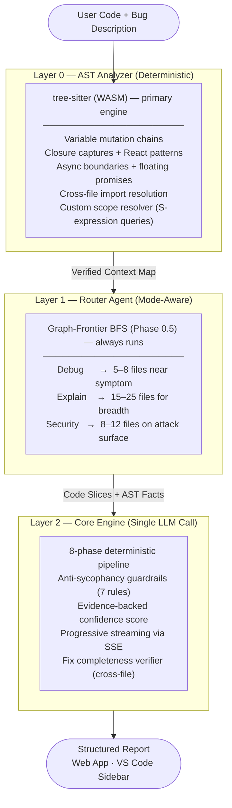

<div align="center">


<br/>

# A debugging pipeline that provides actual facts about code and forces any AI model to think before it guesses.

**Unravel runs a static analysis pass before any LLM sees your code** — extracting mutation chains, async boundaries, closure captures, and cross-file data flows as verified facts. These become ground truth injected into a structured 8-phase reasoning pipeline. Any model you already have becomes significantly more accurate on the bugs that actually matter.

> *Not a smarter model. A smarter way to use the model you already have.*

<br/>

[](https://github.com/EruditeCoder108/UnravelAI)
[](https://github.com/EruditeCoder108/UnravelAI/blob/main/ROADMAP.md)
[](LICENSE)
[](https://vibeunravel.netlify.app)

<br/>

**[Web App →](https://vibeunravel.netlify.app)** &nbsp;&nbsp;·&nbsp;&nbsp; **[Architecture →](ARCHITECTURE.md)** &nbsp;&nbsp;·&nbsp;&nbsp; **[Roadmap →](ROADMAP.md)**

</div>

---

## What Unravel Does

Most AI debuggers pattern-match symptoms. They see a `TypeError` and suggest type fixes. They never ask: where did the data actually go wrong?

Unravel answers that question deterministically. Before any model sees your code, a static AST pass using tree-sitter extracts verified facts — every variable mutation, every closure capture, every async boundary, every cross-file import chain, every React hook dependency gap. These become ground truth injected into an 8-phase structured reasoning pipeline. The model cannot hallucinate about what doesn't exist in the code. It cannot guess — it must trace.

The result: **exact file, exact line, exact variable, with evidence and confidence score.**

---

## Architecture



---

## The 8-Phase Pipeline

The model is forced through these phases in sequence. It cannot skip to conclusions.

| Phase | Name | What Happens |
|------:|------|--------------|
| 1 | **Read** | Read every file completely. No opinions yet. |
| 2 | **Understand Intent** | For each function and module: what is it trying to do? |
| 3 | **Symptom Mapping** | What observable behavior is failing? What is the exact failure event? |
| 4 | **AST Fact Injection** | Inject verified mutation chains, closures, async boundaries as ground truth. |
| 5 | **Hypothesis Generation** | Generate 3 mutually exclusive, non-overlapping hypotheses. |
| 6 | **Hypothesis Elimination** | Kill hypotheses the AST evidence contradicts. Quote the exact line. |
| 7 | **Concept Extraction** | What programming concept does this bug teach? |
| 8 | **Invariants** | What conditions must hold for correctness? |

---

## Anti-Sycophancy Guardrails

Hardcoded into every prompt. The model cannot override these.

```
Rule 1  If the code is correct, say "No bug found." Do not invent problems.
Rule 2  If the user's description contradicts the code, point out the contradiction.
Rule 3  If uncertain, say "Cannot confirm without runtime execution."
Rule 4  Every bug claim must cite exact line number + code fragment as proof.
Rule 5  Never describe code behavior that cannot be verified from provided files.
Rule 6  The crash site is never the root cause. It is the symptom.
        Trace state backwards through mutation chains from the failure point.
        The root cause is where state was first corrupted.
Rule 7  A variable named isPaused does not guarantee the code is paused.
        Verify behavior from the execution chain, not naming conventions.
```

---

## Fix Completeness Verifier

After generating a fix, the engine cross-references it against the AST call graph. If the fix modifies a function in file A but fails to update file B which calls that function, the verifier:

- Penalizes the confidence score by `0.15`
- Injects an explicit warning into the `uncertainties` block: `AST Guard: Fix modifies 'X' but misses updates to downstream caller 'Y'`

No additional LLM calls. Uses data already computed during Layer 0.

---

## Benchmark

Unravel's edge is not on easy, isolated bugs — standalone LLMs handle those adequately. The engine is built for the opposite scenario: large repos, deep cross-file mutation chains, async races across multiple files, bugs where the symptom and root cause live in completely different modules.

Validation on real production repositories — including VS Code, Cal.com, and tldraw — shows the pipeline correctly tracing root causes that raw model queries either miss or misattribute.

**Formal benchmark in progress:**

| Suite | Status | Model | Notes |
|-------|--------|-------|-------|
| UDB-11 (11 bugs) | Complete | Gemini 2.5 Flash | Early signal. +9% RCA, −35% hallucination rate. |
| UDB-51 (51 bugs, 8 categories) | In progress | Gemini 2.5 Flash → Claude Opus 4.6 | Hard bugs, large context, multi-file. The real number. |
| 20 real GitHub issues | Planned | Multi-model | Next.js, React, Vite, Express — compared against actual merged fixes. |

> UDB-51 with Claude Opus 4.6 on hard, large-context bugs is what gets published.

---

## Three Analysis Modes

<details>
<summary><b>Debug Mode</b> — Full 8-phase root cause diagnosis</summary>

<br/>

The full pipeline. Traces state backwards from the symptom through mutation chains to the exact corruption point. Returns: root cause, evidence, fix proposal, confidence score, and Mermaid visualizations.

Best for: production bugs, async races, cross-file state corruption, anything that resisted multiple AI attempts.

</details>

<details>
<summary><b>Explain Mode</b> — Architecture walkthrough for unfamiliar codebases</summary>

<br/>

Reads 15–25 files for breadth. Maps module responsibilities, data flow direction, entry points, and dependency graph. Generates Data Flow and Dependency diagrams. No fix proposed — insight is the goal.

Best for: onboarding to a new codebase, understanding legacy code, pre-refactor mapping.

</details>

<details>
<summary><b>Security Mode</b> — Vulnerability audit with exploit tracing</summary>

<br/>

Traces attack surface across 8–12 files. Requires a concrete exploit payload for any flagged vulnerability — no vague "this could be vulnerable" claims. Returns: vulnerability type, attack vector, proof-of-exploit, severity, and remediation.

Best for: pre-deploy security checks, reviewing user-input handling, third-party dependency chains.

</details>

---

## Output Presets

| Preset | Fields |
|--------|--------|
| **Quick Fix** | Root cause + fix only. Read in 30 seconds. |
| **Developer** | Root cause + fix + evidence + confidence. |
| **Full Report** | All sections — hypothesis elimination, per-phase trace, all diagrams. |
| **Custom** | Per-section checkboxes. Build your own report. |

---

## Mermaid Visualizations

Every Full Report includes auto-generated diagrams:

- **Timeline** — Event sequence leading to the bug
- **Hypothesis Tree** — Branching elimination logic
- **Data Flow** — How data moves through the system
- **Dependency Graph** — Module import relationships
- **Attack Vector** *(Security mode)* — Exploit entry-to-impact path
- **Variable State** — Mutation chain for the root cause variable

---

## Supported Models

Any LLM whose API you have access to — Anthropic, Google, OpenAI.

Your API key. Your model. No data sent to Unravel servers.

---

## Bug Taxonomy

Every diagnosis is classified across 12 formal categories:

```javascript
const BUG_TAXONOMY = {
  STATE_MUTATION:  "Variable meant to be constant is modified unexpectedly",
  STALE_CLOSURE:   "Function captures outdated variable value",
  RACE_CONDITION:  "Multiple async operations conflict on shared state",
  TEMPORAL_LOGIC:  "Timing assumptions break (drift, wrong timestamps)",
  EVENT_LIFECYCLE: "Missing cleanup, double-binds, or wrong event order",
  TYPE_COERCION:   "Implicit type conversion causes unexpected behavior",
  ENV_DEPENDENCY:  "Code behaves differently across environments",
  ASYNC_ORDERING:  "Operations execute in wrong sequence",
  DATA_FLOW:       "Data passes incorrectly between components or files",
  UI_LOGIC:        "Visual behavior does not match intent",
  MEMORY_LEAK:     "Resources not released, accumulate over time",
  INFINITE_LOOP:   "Recursive or cyclic behavior creates runaway effect",
};
```

---

## Getting Started

### Web App

No install required. Visit **[vibeunravel.netlify.app](https://vibeunravel.netlify.app)** and:

1. Enter your API key (Anthropic, Google, or OpenAI)
2. Upload project files, paste code, or import a GitHub URL
3. Describe the bug symptom
4. Select Debug, Explain, or Security mode
5. Read the diagnosis

### VS Code Extension

The extension is currently in development and not yet published to the Marketplace. To use it locally:

```bash
git clone https://github.com/EruditeCoder108/UnravelAI.git
cd UnravelAI
npm install
npm run build:extension
```

Then install the generated `.vsix` file via **Extensions → Install from VSIX** in VS Code.

### Run Locally

```bash
git clone https://github.com/EruditeCoder108/UnravelAI.git
cd UnravelAI
npm install
npm run dev
```

---

## Project Status

```
Phase 1    ✅  Web app, 8-phase pipeline, multi-provider, anti-sycophancy (7 rules)
Phase 2    ✅  AST pre-analysis, open source
Phase 3    ✅  Core engine extracted, VS Code extension (v0.3.0) end-to-end
Phase 4A   ✅  Multi-mode analysis (Debug / Explain / Security) + output presets
Phase 5    ✅  GitHub Issue URL parsing, Action Center (Web + VS Code)
Phase 4B   ✅  Intelligence layer — complete:
               ✅  Cross-file AST import resolution (ast-project.js)
               ✅  Graph-frontier deterministic router (BFS, wired as Phase 0.5)
               ✅  Progressive streaming (SSE, all 3 providers)
               ✅  Tree-sitter primary engine — Babel removed
               ✅  Floating promise detection (isAwaited guard)
               ✅  React-specific AST patterns (useState, useEffect, useMemo/useCallback)
               ✅  Fix completeness verifier (cross-file call graph guard)
               ✅  proximate_crash_site field + Variable Trace UI
               ✅  Prompt hardening (Rule 6, Rule 7, buggy context warning, mutual exclusivity)
               📋  CFG branch annotation
Phase 8    📋  UDB-51 benchmark — 51 bugs, 8 categories, multi-model
Phase 9    📋  Real-world validation — 20 real GitHub issues, API pitch data
Phase 10   📋  Unravel Heavy — multi-agent parallel analysis
```

**[See full roadmap →](ROADMAP.md)**

---

## Design Principles

Every decision flows from five rules:

1. **Deterministic facts before AI reasoning.** AST runs first. The model gets verified ground truth.
2. **Evidence required for every claim.** No bug report without exact line and code fragment.
3. **Eliminate wrong hypotheses, don't guess at right ones.** Generate three, kill what the evidence contradicts.
4. **Never hide uncertainty.** Uncertain is better than confident-wrong.
5. **Optimize for developer understanding, not impressive output.** Insight over length.

---

## The Number That Will Matter

**RCA with AST pre-analysis vs without, on hard bugs, on a SOTA model, at scale.**

The honest version of that number doesn't exist yet. UDB-11 is early signal. UDB-51 with Claude Opus 4.6 across 8 bug categories — async races, cross-file state, closures, React state, security, performance — run against the same bugs on a raw baseline, is what actually proves the claim.

Target: **≥85% RCA enhanced, ≥+10% delta over baseline, <5% hallucination rate.**

Until then: the pipeline is open source, the web app is live, and you can run it on your own hardest bugs right now.

---

## Contributing

See [CONTRIBUTING.md](CONTRIBUTING.md). Bug reports, new benchmark bugs, and prompt improvement proposals are especially welcome.

```bash
# Run the benchmark suite
node benchmarks/runner.js

# Run tests
npm test
```

---

## License

BSL 1.1 — see [LICENSE](LICENSE).

---

<div align="center">


<br/>

**Built by [Sambhav Jain](https://github.com/EruditeCoder108)**

*If Unravel found a bug your AI missed, a star helps.*

</div>
