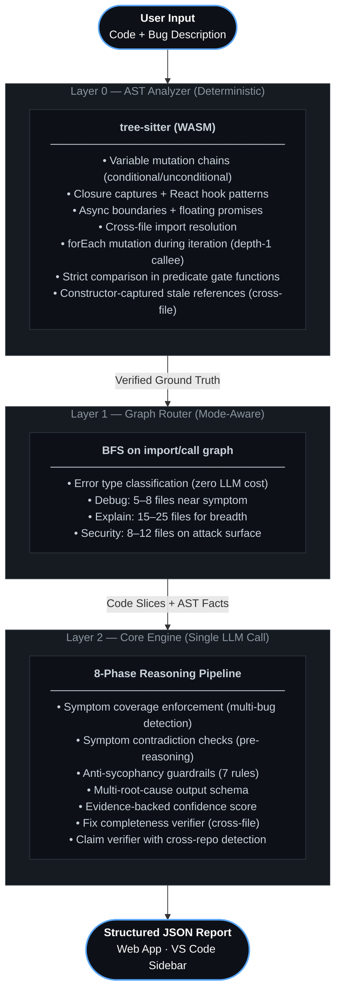

<div align="center">


<br/>

https://github.com/user-attachments/assets/897ba07f-eaa5-4d95-b5a9-88a4fedfbf6a

<br/>

<h1>Unravel</h1>

<p>
A static AST analysis engine that extracts verified structural facts from code<br/>
and injects them as ground truth before an LLM reasons about a bug.
</p>

<table>
<tr>
<td width="33%" align="center"><b>In one sentence</b><br/><br/>Unravel forces LLMs to debug using verified execution facts instead of pattern-matching symptoms.</td>
<td width="33%" align="center"><b>Why it matters</b><br/><br/>Most LLM debugging failures come from missing state mutation history — the model sees the crash, not where the data went wrong first.</td>
<td width="33%" align="center"><b>What's new</b><br/><br/>AST-extracted ground truth (mutation chains, async boundaries, spec violations) injected as non-negotiable constraints into a structured reasoning pipeline.</td>
</tr>
</table>

[](https://github.com/EruditeCoder108/UnravelAI)
[](#benchmark)
[](https://reactjs.org)
[](https://nodejs.org)
[](https://tree-sitter.github.io)
[](#language-support)
[](LICENSE)
[](https://vibeunravel.netlify.app)
[](arXiv-paper.pdf)

<br/>

**[Try it →](https://vibeunravel.netlify.app)** &nbsp;·&nbsp; **[Architecture →](ARCHITECTURE.md)** &nbsp;·&nbsp; **[Benchmark →](#benchmark)** &nbsp;·&nbsp; **[Paper →](arXiv-paper.pdf)**

</div>

---

## What this is

LLMs debugging code have a consistent failure mode: they see the crash and reason backwards from the symptom. They never ask where the data was *first* corrupted, because they don't know. They see a `TypeError` and suggest type fixes. They see "timer wrong after pause" and guess stale closures. They're pattern-matching your description, not analyzing your code.

Unravel runs a deterministic tree-sitter AST pass before any LLM call. It extracts:

- **Every variable mutation** — by function, by line, conditional vs. unconditional path
- **Every async boundary** — `setTimeout`, `setInterval`, `addEventListener`, floating promises
- **Every closure capture** — inner functions reading outer scope bindings that may be stale
- **Cross-file import chains** — what depends on what, exactly
- **forEach iteration mutations** — where a Set/Map/Array is mutated during its own `.forEach()` callback (including via helper functions one level deep) — a JavaScript spec fact, not a suspicion
- **Strict comparisons in predicate gates** — `>` instead of `>=` inside functions named `is*`, `can*`, `has*`, `meets*` — the pattern that causes off-by-one permission bugs

These are injected as verified ground truth before the LLM reasons. The model is explicitly instructed to treat them as non-negotiable constraints, and contradictions are penalized by the verifier. It must trace state backwards from the failure through the actual mutation chain to where it was first corrupted.

The result is a structured JSON report: root cause, evidence, unified diff fix, hypothesis tree with per-hypothesis elimination citations, confidence score.

---

## Table of Contents

- [Real-World Proof](#real-world-proof)
- [Quickstart](#quickstart)
- [The Core Problem](#the-core-problem)
- [Architecture](#architecture)
- [Pipeline](#the-8-phase-pipeline)
- [New Detectors](#new-detectors-v33)
- [Anti-Sycophancy Guardrails](#anti-sycophancy-guardrails)
- [Benchmark](#benchmark)
- [Supported Models](#supported-models)
- [Language Support](#language-support)
- [Output Presets](#output-presets)
- [Bug Taxonomy](#bug-taxonomy)
- [Design Principles](#design-principles)
- [Project Status](#project-status)
- [Contributing](#contributing)
- [License](#license)

---

## Real-World Proof

Tested on real bugs in major open-source repositories before any formal benchmark. The diagnoses — exact file, exact line, exact mutation chain — were applied directly:

| Repository | Bug | Scope |
|------------|-----|-------|
| **cal.com** | Settings toggles blocking each other — shared `useMutation` hook propagating `isUpdateBtnLoading` to all toggles | 8,000+ file monorepo |
| **tldraw** | `create-tldraw` CLI installing into CWD instead of subdirectory | Multi-package CLI |

<div align="center">

&nbsp;&nbsp;

</div>

<div align="center">

</div>

---

## Quickstart

**Web App — no install:**

1. Open **[vibeunravel.netlify.app](https://vibeunravel.netlify.app)**
2. Enter your API key (Anthropic, Google, or OpenAI)
3. Paste a GitHub issue URL or upload files
4. Describe the bug — or leave it blank for a full scan
5. Read the diagnosis

**VS Code Extension:**

```bash
# Download unravel-vscode-0.3.0.vsix from GitHub, then:
code --install-extension unravel-vscode-0.3.0.vsix
```

Or: **Extensions → Install from VSIX** → select the [downloaded `.vsix`](unravel-vscode/unravel-vscode-0.3.0.vsix).

Right-click any JS/TS file → **Unravel: Debug This File**.

**Run locally:**

```bash
git clone https://github.com/EruditeCoder108/UnravelAI.git
cd UnravelAI/unravel-v3
npm install && npm run dev
```

---

## The Core Problem

A real Pomodoro timer bug. Same model. Same code. Two contexts.

<table>
<thead>
<tr>
<th width="50%">Without Unravel</th>
<th width="50%">With Unravel</th>
</tr>
</thead>
<tbody>
<tr>
<td>

```
"This looks like a race condition or a
stale closure. Try adding a .catch()
block or wrapping the reset logic in
a setTimeout to let state settle."
```

> Confident. Plausible. **Wrong.**

</td>
<td>

```
AST VERIFIED — script.js

duration: MUTATED at pause() L69 ⚠ [CONDITIONAL]
  written: pause() L69, setMode() L86
  read:    tick() L55, reset() L79

Root Cause: duration is a config variable
being overwritten as runtime state.
reset() at L79 reads the corrupted value.

Fix: Remove mutation at L69.
Add lastActiveRemaining for pause state.

--- script.js L69
-    duration = remaining
+    lastActiveRemaining = remaining

Confidence: 0.94
```

> Traced. Evidenced. **Exact.**

</td>
</tr>
</tbody>
</table>

The second output is not the result of better prompting. It's the result of the model being told, as a verified fact, that `duration` was mutated at L69 on a conditional path — and that `reset()` reads it. The model doesn't need to guess what might cause the bug. It has the cause.

---

## Architecture



<details>
<summary><b>▸ &nbsp; Step-by-step: How Unravel processes a request</b></summary>

<br/>

**Step 1 — Input arrives.**
User uploads files and describes the bug. Unravel checks every file for truncation signals (unbalanced braces, missing closing tags) and injects completeness warnings if anything looks cut off. A deterministic error-type classifier categorises the symptom as `PACKAGE_RESOLUTION`, `BUILD_CONFIG`, `RUNTIME_TYPE`, or `RUNTIME_LOGIC` — before any LLM call — so routing and the verifier stage apply the right heuristics.

**Step 2 — Graph Router trims the search space.**
If more than 15 files are provided, a BFS traversal of the import/call graph selects only the files most likely to contain the root cause. Debug mode focuses on 5–8 files around the symptom. Explain mode reads 15–25 for architectural breadth. Security mode follows the attack surface.

**Step 3 — AST engine runs deterministically.**
tree-sitter (WASM) walks every JS/TS file and extracts: all variable mutation chains (every write/read, by function, by line, conditional or unconditional), all closure captures, all async boundaries and floating promises, all React hook patterns. A second cross-file pass builds the import/call graph. Two new detectors run: `detectForEachCollectionMutation` (with depth-1 callee expansion — detects mutations via helper functions, not just inline) and `detectStrictComparisonInPredicateGate` (structural naming-convention signal, not domain vocabulary).

**Step 4 — Symptom coverage is enforced.**
If the symptom description contains a numbered list, bullet points, or explicit "N independent bugs/issues" language, a coverage requirement is injected into the prompt: the model must address every described behavior or explicitly mark it as unresolved in `uncoveredSymptoms[]`. This forces multi-bug reports to be treated as multi-bug reports.

**Step 5 — Symptom contradictions are checked.**
Before the model reasons, AST facts are compared against the user's symptom. If the user says "event not firing" but AST confirms `addEventListener` is wired, that contradiction is injected as an explicit alert.

**Step 6 — Ground truth is injected.**
The AST output is framed as verified facts the model is explicitly instructed to treat as non-negotiable constraints — contradictions trigger verifier penalties. Every mutation (with conditional context), every boundary, every closure — exact file and line. Verified findings (mutation chains, spec violations) are separated from heuristic signals (predicate gate comparisons) so the model knows what is certain and what requires confirmation.

**Step 7 — The 8-phase pipeline runs.**
One LLM call. The model is forced through: Read → Understand Intent → Understand Reality (3 mutually exclusive hypotheses) → Build Context → Diagnose (eliminate hypotheses by quoting exact AST evidence) → Minimal Fix → Concept Extraction → Invariants. It cannot skip to a conclusion.

**Step 8 — The claim verifier cross-checks the output.**
Every file reference and line number in the model's response is verified against the actual files. Fabricated references trigger confidence penalties. A fabricated root cause triggers a hard rejection and retry.

**Step 9 — Fix completeness check.**
The cross-file call graph (already built in Step 3) is checked against the proposed fix. If the fix modifies a function in file A but ignores file B which calls it, a warning is injected and confidence is penalized.

</details>

---

## New Detectors (v3.3)

### 1. forEach Collection Mutation — Verified Structural Fact

Detects `Set`, `Map`, or `Array` being mutated (`.delete()`, `.add()`, `.set()`, `.push()`, etc.) inside its own `.forEach()` callback. Includes **depth-1 callee expansion**: if the callback delegates to a helper function (`forEach(v => helper(v))`), the detector follows into `helper`'s body and checks for mutations there.

This is not a heuristic. It cites the exact ECMAScript specification:

> *ECMA-262 §24.2.3.7: If a Set entry is deleted during iteration and then re-added, it will be visited again. `.delete(x)` followed by `.add(x)` inside a `.forEach()` callback causes `x` to be processed **twice**.*

The annotation is injected as a verified structural fact, not a suspicion. The model cannot contradict it.

**Why depth-1 expansion matters:** Real code abstracts iteration callbacks into helpers. Without it, a pattern like:

```js
votes.forEach(voter => _refreshVoterRecord(voter));
// _refreshVoterRecord: votes.delete(voter); votes.add(updated);
```

...is invisible to a surface-only detector. With depth-1 expansion, `_refreshVoterRecord` is looked up in the file's function body map and searched for `votes.*` mutations. The hit is tagged `delete() (via _refreshVoterRecord()) L526`.

### 2. Strict Comparison in Predicate Gate — Heuristic Signal

Detects `>` or `<` comparisons inside functions whose names follow universal predicate naming conventions: `is*`, `can*`, `has*`, `should*`, `meets*`, `passes*`, `eligible*`. Clearly labelled as a heuristic signal, not a verified bug.

**The signal is structural (naming convention), not domain-specific (vocabulary).** It fires equally on:
- `isAdult(age)` → `age > 18` — should this be `>=`?
- `canBorrow(score)` → `score > limit`
- `hasPermission(level)` → `level > required`
- `isLogUpToDate(idx)` → `idx > lastIndex`
- `meetsThreshold(val)` → `val > minimum`

Output appears in a clearly separated `HEURISTIC ATTENTION SIGNALS` block with explicit labelling — never mixed into the verified facts section.

### 3. Multi-Root-Cause Output Schema

`additionalRootCauses[]` and `uncoveredSymptoms[]` added to the output schema. The model is instructed with a precise independence test: a second root cause must have a different trigger condition, a different fix location, AND a different observable symptom. Fixing the primary root cause must not also fix it. A crash and its missing null guard are not two root causes. Two bugs in separate functions with independent failure modes are.

### 4. Symptom Coverage Enforcement

Fires when the symptom description contains a numbered list (`1. ... 2. ...`), a bullet list (`- ... - ...`), or explicit "N independent/separate bugs" language. Injects a coverage requirement before LLM reasoning: every described behavior must be either (A) explained as a causal consequence of the root cause, (B) identified as a separate independent root cause in `additionalRootCauses[]`, or (C) listed in `uncoveredSymptoms[]` with a reason it can't be diagnosed.

---

## Anti-Sycophancy Guardrails

Every AI debugger has the same failure mode: it agrees with you. You say "race condition," it finds a race condition — whether or not one exists. Seven hardcoded rules the model cannot override:

> **Rule 1** — If the code is correct, say *"No bug found."* Do not invent problems.

> **Rule 2** — If the user's description contradicts the code, point out the contradiction.

> **Rule 3** — If uncertain, say *"Cannot confirm without runtime execution."*

> **Rule 4** — Every bug claim must cite exact line number + code fragment as proof.

> **Rule 5** — Never describe code behavior that cannot be verified from provided files.

> **Rule 6** — The crash site is never the root cause. Trace state backwards through mutation chains from the failure point. The root cause is where state was *first* corrupted.

> **Rule 7** — A variable named `isPaused` does not guarantee the code is paused. Verify behavior from the execution chain, not naming conventions.

---

## The 8-Phase Pipeline

| Phase | Name | What Happens |
|------:|------|--------------|
| 1 | **Read** | Read every file completely. No opinions yet. |
| 2 | **Understand Intent** | For each function and module: what is it *trying* to do? |
| 3 | **Understand Reality** | What is the code actually doing? Generate exactly 3 mutually exclusive hypotheses for any divergence. |
| 4 | **Build Context** | Map dependencies and boundaries. Use AST ground truth — do not contradict it. |
| 5 | **Diagnose** | Test each hypothesis against AST evidence. Kill contradicted ones. Quote the exact AST line that eliminates each — no citation, no elimination. |
| 6 | **Minimal Fix** | Smallest surgical change, with unified diff. Architectural note added only for structural root causes. |
| 7 | **Concept Extraction** | What programming concept does this bug teach? |
| 8 | **Invariants** | What conditions must hold for correctness? |

---

## Benchmark

> **This is a stress benchmark, not a coverage benchmark.** Each bug is designed to target a known LLM failure mode — proximate fixation, sycophancy, async reasoning failures, multi-file state corruption — not to represent real-world frequency. 22 carefully adversarial bugs reveal more about failure modes than 200 average ones.

The benchmark validates on bugs where the model's behavior without AST grounding is known to fail or be unreliable. Easy, isolated bugs are not the target — any modern LLM handles those.

### B-01 to B-21: Internal validation suite

| Suite | Result | Model | Notes |
|-------|--------|-------|-------|
| B-01 to B-20 (20 bugs) | 119/120 (99.2%) | Gemini 2.5 Flash + AST | One partial on PFR axis |
| B-21: Ghost Tenant (extreme — 8-file multi-tenant race) | 6/6 (100%) | Gemini 2.5 Flash + AST | Global state write before async yield |
| **Total** | **125/126 (99.2%)** | | |

Baseline comparison on the same bugs (Claude Sonnet 4.6, structured prompt, no AST):

| System | Score | Notes |
|--------|-------|-------|
| Unravel (AST + Gemini 2.5 Flash) | 98.3% | |
| Claude Sonnet 4.6 (structured prompt, no AST) | 100% | Optimal prompting, frontier model |

The AST engine closes the reasoning gap between a fast, cheap model (Gemini 2.5 Flash) and a frontier model. The systems are **comparable on this benchmark** at peak configuration — which means Unravel's value is running smaller/cheaper models at near-frontier accuracy on hard bugs, not outperforming frontier models outright.

### B-22: Raft Consensus — 3 independent bugs in 2,800 lines

The most challenging benchmark to date: a single large file (`raft-node.js`) with three independent bugs forming two distinct failure modes.

| Bug | Mechanism |
|-----|-----------|
| **Mode A** | `promotePreVotesToGrants` injects pre-vote records with `term: N-1` into `_grantedVotes`. `checkQuorum` calls `_refreshVoterRecord` which does `.delete(voterId)` + `.add(voterId)` on the same `Set` during `.forEach()`. ECMA-262: deleted-then-re-added elements are visited again — votes are double-counted. False quorum → split-brain. |
| **Mode B** | `_isLogUpToDate` uses `>` instead of `>=` for the index comparison when terms match. Peers with equal logs reject valid candidates. Violates Raft §5.4.1. |

**What each engine component contributed:**

- **`detectForEachCollectionMutation`** — injected the ECMA-262 spec citation for the `.delete()` + `.add()` pattern as a verified fact. The LLM, knowing the pattern is a spec violation, reasoned to eliminate it entirely rather than patch around it: removed `_refreshVoterRecord`, removed the refresh logic in `checkQuorum`, replaced the unconditional `count++` with `if (record.term === currentTerm) count++`.
- **Symptom coverage enforcer** — the symptom described Mode A and Mode B as numbered behaviors. The enforcer forced both to be addressed. Mode B (`_isLogUpToDate`) was found by the LLM reading the code once directed to look at log comparisons — no domain vocabulary heuristic involved.
- **Multi-root-cause schema** — `additionalRootCauses[]` gave separate structured fields for both independent fixes.

| Axis | Unravel | Claude Sonnet 4.6 | Notes |
|------|:-------:|:-----------------:|-------|
| RCA — Mode A | ✅ | ✅ | Both: correct root cause, correct files and lines |
| RCA — Mode B | ✅ | ✅ | Both: `_isLogUpToDate` strict `>` |
| Evidence + causal chain | ✅ | ✅ | Both: full chains on both modes |
| Fix — Mode B | ✅ | ✅ | Both: `>` → `>=` |
| Fix — Mode A correctness | ✅ | ✅ | Both remove `promotePreVotesToGrants` call |
| Fix — Mode A completeness | **More complete** | Partial | Unravel removes `_refreshVoterRecord` + refresh mechanism. Claude left them as dead code. |
| **Total** | **6/6** | **6/6** | Tie on rubric, Unravel more complete on fix |

Note on fix completeness: With only `promotePreVotesToGrants` removed, `_refreshVoterRecord` remains a latent hazard — it will activate again if any future code introduces stale records. Removing the entire pattern (function + caller + mechanism) is the structurally complete fix. The ECMA-262 annotation is why Unravel got there: the model was told the `.delete()` + `.add()` pattern is a spec violation, not just logically misguided, which caused it to reason "eliminate the pattern" rather than "remove the function that creates the triggering records."

The validation data is in [`validation/results/raft node/`](validation/results/raft%20node/).

---

## Three Modes

<table>
<tr>
<td width="33%" align="center">

### Debug
**Root cause diagnosis**

Full 8-phase pipeline. Traces state backwards from the symptom through mutation chains to the exact corruption point.

Returns: root cause · evidence · unified diff · confidence · Mermaid diagrams

*Best for: production bugs, async races, cross-file state corruption, anything that resisted multiple AI attempts.*

</td>
<td width="33%" align="center">

### Explain
**Architecture walkthrough**

Reads 15–25 files for breadth. Maps module responsibilities, data flow direction, entry points, and dependency graph.

Returns: module map · data flow · dependency graph · onboarding guide

*Best for: onboarding to a new codebase, pre-refactor mapping, understanding legacy code.*

</td>
<td width="33%" align="center">

### Security
**Vulnerability audit**

Traces attack surface across 8–12 files. Requires a concrete exploit payload — no vague "could be vulnerable" claims.

Returns: vulnerability type · attack vector · proof-of-exploit · severity · remediation

*Best for: pre-deploy audits, user-input chains, third-party dependency reviews.*

</td>
</tr>
</table>

---

## Supported Models

Your key. Your model. No data sent to Unravel servers.

| Provider | Models |
|----------|--------|
| **Anthropic** | Claude Opus 4.5 · Claude Sonnet 4.5 · Claude Haiku 3.5 |
| **Google** | Gemini 2.5 Flash · Gemini 2.5 Pro |
| **OpenAI** | GPT-4o · GPT-4o-mini · o3 |

---

## Language Support

AST analysis currently supports **JavaScript · TypeScript · JSX · TSX** via tree-sitter WASM. The 8-phase pipeline and all three modes work for any language via the LLM layer; AST ground truth extraction is JS/TS-only.

Python, Go, and Rust are next on the roadmap.

---

## Output Presets

| Preset | What You Get |
|--------|-------------|
| **Quick Fix** | Root cause + fix only. Read in 30 seconds. |
| **Developer** | Root cause + fix + evidence + confidence score. |
| **Full Report** | All sections: hypothesis elimination, per-phase trace, all Mermaid diagrams. |
| **Custom** | Per-section checkboxes. Build exactly the report you need. |

Every Full Report includes auto-generated Mermaid diagrams: Timeline · Hypothesis Tree · Data Flow · Dependency Graph · Variable State · Attack Vector *(Security mode)*

---

## Diagnosis Verdicts

Every analysis concludes with one of three structured verdicts.

**Normal diagnosis** — The bug is in the provided codebase. Returns `rootCause`, `minimalFix`, unified `diffBlock`, `hypothesisTree` with per-hypothesis `eliminatedBy` citations, `evidence[]`, `confidence`, and Mermaid edge data. If the symptom described multiple independent failure modes, also returns `additionalRootCauses[]`.

**`LAYER_BOUNDARY`** — The root cause is upstream of all provided code: in the OS, the browser's native event system, a runtime, or a third-party native layer. The engine refuses to generate a patch that would be wrong by construction. Returns `rootCauseLayer`, `reason`, and `suggestedFixLayer`.

**`EXTERNAL_FIX_TARGET`** — The diagnosis is correct and the bug is real, but the fix must be applied in a different repository. Returns the full diagnosis alongside `targetRepository`, `targetFile`, and `suggestedAction`.

---

## Bug Taxonomy

Every diagnosis is classified across 12 formal categories:

```javascript
const BUG_TAXONOMY = {
  STATE_MUTATION:  "Variable meant to be constant is modified unexpectedly",
  STALE_CLOSURE:   "Function captures outdated variable value",
  RACE_CONDITION:  "Multiple async operations conflict on shared state",
  TEMPORAL_LOGIC:  "Timing assumptions break (drift, wrong timestamps)",
  EVENT_LIFECYCLE: "Missing cleanup, double-binds, or wrong event order",
  TYPE_COERCION:   "Implicit type conversion causes unexpected behavior",
  ENV_DEPENDENCY:  "Code behaves differently across environments",
  ASYNC_ORDERING:  "Operations execute in wrong sequence",
  DATA_FLOW:       "Data passes incorrectly between components or files",
  UI_LOGIC:        "Visual behavior does not match intent",
  MEMORY_LEAK:     "Resources not released, accumulate over time",
  INFINITE_LOOP:   "Recursive or cyclic behavior creates runaway effect",
};
```

---

## Design Principles

> **1. Deterministic facts before AI reasoning.**
> The AST pass runs first. The model receives verified ground truth, not a blank canvas.

> **2. Evidence required for every claim.**
> No bug report without exact line number and code fragment. No exceptions.

> **3. Eliminate wrong hypotheses — don't guess at right ones.**
> Generate multiple explanations, then kill the ones the evidence contradicts. The survivor is the diagnosis.

> **4. Never hide uncertainty.**
> *Uncertain* is better than *confident-wrong.* If two of three hypotheses survive elimination, say so.

> **5. Separate verified facts from heuristic signals.**
> AST-verified structural facts and heuristic attention signals appear in different output sections with different epistemic labels. The model knows which is which. So does the developer.

> **6. Optimize for developer understanding, not impressive output.**
> The goal is insight. Not a longer report.

---

## Project Status

```
Phase 1    [done]  Web app, 8-phase pipeline, multi-provider, anti-sycophancy (7 rules)
Phase 2    [done]  AST pre-analysis, open source
Phase 3    [done]  Core engine extracted, VS Code extension (v0.3.0) end-to-end
Phase 3.5  [done]  Pre-publish hardening (MemberExpression detection, input completeness)
Phase 3.6  [done]  File handling hardening (Router-first GitHub, empty symptom support)
Phase 4A   [done]  Multi-mode analysis (Debug / Explain / Security) + output presets
Phase 5    [done]  GitHub Issue URL parsing, Action Center (Web + VS Code)
Phase 4B   [done]  Intelligence layer:
               Cross-file AST import resolution (ast-project.js)
               Graph-frontier deterministic router (BFS, wired as Phase 0.5)
               Progressive streaming (SSE, all 3 providers)
               Tree-sitter primary engine — Babel removed
               Floating promise detection (isAwaited guard)
               React-specific AST patterns (useState, useEffect, useMemo/useCallback)
               Fix completeness verifier (cross-file call graph guard)
               proximate_crash_site field + Variable Trace UI
               Prompt hardening (Rule 6, Rule 7, buggy context warning, mutual exclusivity)
               CFG branch annotation — conditional vs. unconditional per mutation
               Hypothesis elimination scoring — eliminatedBy field, AST citation required
               Symptom contradiction checks — listener gap, crash site != root cause
               Visual diff output — unified diffBlock field in every fix
Phase 5.5  [done]  Pipeline hardening — error type classifier, cross-repo verdict,
               verifier whitelist, LAYER_BOUNDARY false-positive fix, discipline rules,
               EXTERNAL_FIX_TARGET verdict, framework name stop-list
Phase 5.6  [done]  forEach mutation detector (ECMA-262 §24.2.3.7, depth-1 callee expansion)
               Predicate gate strict comparison heuristic (structural, naming-convention)
               Multi-root-cause schema (additionalRootCauses[], uncoveredSymptoms[])
               Symptom coverage enforcement (numbered/bullet list detection)
Phase 8    [planned]  UDB-51 benchmark — 51 bugs, 8 categories, multi-model comparison
Phase 9    [planned]  Real-world validation — 20 real GitHub issues
Phase 10   [planned]  Unravel Heavy — multi-agent parallel analysis
```

---

## Contributing

See [CONTRIBUTING.md](CONTRIBUTING.md). Bug reports, new benchmark bugs, and detector proposals are especially welcome. The benchmark suite is in [`validation/`](validation/) — every result has a grade sheet with honest scoring.

## License

BSL 1.1 — see [LICENSE](LICENSE).

<br/>

<div align="center">

**Built by [Sambhav Jain](https://github.com/EruditeCoder108)**

[Web App](https://vibeunravel.netlify.app) &nbsp;·&nbsp; [VS Code Extension](unravel-vscode/unravel-vscode-0.3.0.vsix) &nbsp;·&nbsp; [Research Paper](arXiv-paper.pdf) &nbsp;·&nbsp; [Architecture](ARCHITECTURE.md)

*If Unravel found a bug your AI missed — a star helps.*

</div>
