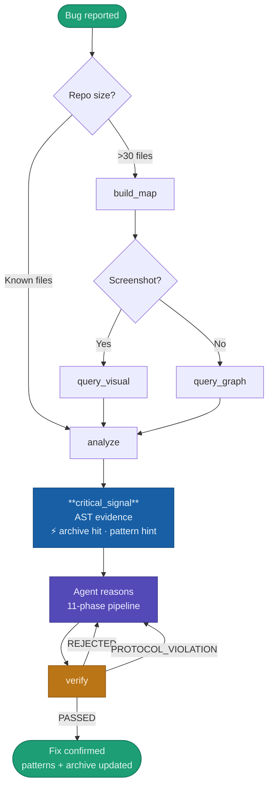
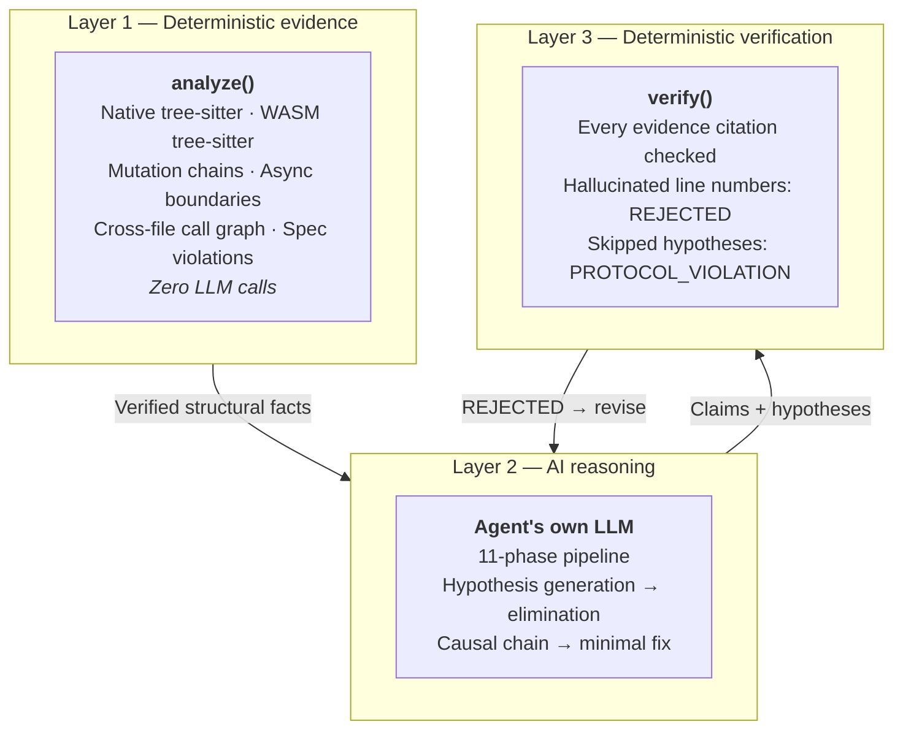
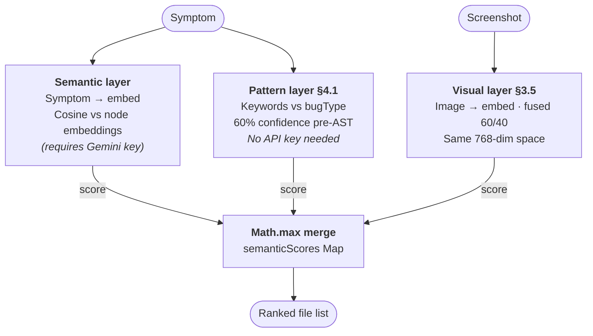
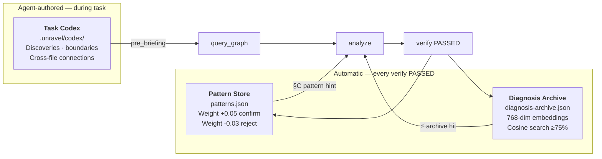

<div align="center">



<br/>

https://github.com/user-attachments/assets/897ba07f-eaa5-4d95-b5a9-88a4fedfbf6a

<br/>

<h1>Unravel</h1>

<p>
A deterministic AST evidence engine that extracts verified structural facts from code<br/>
and enforces hallucination-free debugging — for Claude Code, Gemini CLI, Cursor, and any MCP-compatible agent.
</p>

<table>
<tr>
<td width="33%" align="center"><b>In one sentence</b><br/><br/>Unravel forces AI agents to debug using verified execution facts instead of pattern-matching symptoms.</td>
<td width="33%" align="center"><b>Why it matters</b><br/><br/>Most LLM debugging failures come from missing state mutation history — the model sees the crash, not where the data went wrong first.</td>
<td width="33%" align="center"><b>What's different</b><br/><br/>Every verified diagnosis is embedded and stored. The next similar bug gets a semantic archive hit before the agent reads a single file. The engine learns from its own track record.</td>
</tr>
</table>

[](https://github.com/EruditeCoder108/UnravelAI)
[](#benchmark)
[](https://modelcontextprotocol.io)
[](https://reactjs.org)
[](https://nodejs.org)
[](https://tree-sitter.github.io)
[](#language-support)
[](LICENSE)
[](https://vibeunravel.netlify.app)

<br/>

**[MCP Quickstart →](#mcp-quickstart)** &nbsp;·&nbsp; **[Web App →](https://vibeunravel.netlify.app)** &nbsp;·&nbsp; **[Architecture →](#architecture)** &nbsp;·&nbsp; **[Benchmark →](#benchmark)**

</div>

---

## What this is

LLMs debugging code have a consistent failure mode: they see the crash and reason backwards from the symptom. They never ask where the data was *first* corrupted, because they don't know. They see a `TypeError` and suggest type fixes. They see "timer wrong after pause" and guess stale closures. They're pattern-matching your description, not analyzing your code.

This is not a Cursor plugin or a smarter prompt wrapper. Unravel runs a deterministic tree-sitter AST pass on your code and extracts verified structural facts — mutation chains, async boundaries, closure captures, spec violations — then hands those facts to the AI as ground truth it cannot contradict. After the AI reasons, a second deterministic pass checks every claim it made against the real code. Hallucinated line numbers are rejected. Fabricated variable names are rejected.

This is the **Sandwich Architecture**: deterministic evidence at the bottom, AI reasoning in the middle, deterministic verification at the top. The AI fills the sandwich. Unravel ensures the bread is real.

---

## Real-World Proof

Tested on real bugs in major open-source repositories before any formal benchmark:

| Repository | Bug | Scope |
|------------|-----|-------|
| **cal.com** | Settings toggles blocking each other — shared `useMutation` hook propagating `isUpdateBtnLoading` to all toggles | 8,000+ file monorepo |
| **tldraw** | `create-tldraw` CLI installing into CWD instead of subdirectory | Multi-package CLI |

<div align="center">

&nbsp;&nbsp;

</div>

<div align="center">

</div>

---

## Table of Contents

- [MCP Quickstart](#mcp-quickstart)
- [Web App & VS Code](#web-app--vs-code)
- [The Core Problem](#the-core-problem)
- [Architecture — The Sandwich](#architecture)
- [The 6 MCP Tools](#the-6-mcp-tools)
- [The 11-Phase Pipeline](#the-11-phase-pipeline)
- [AST Detectors](#ast-detectors)
- [Anti-Sycophancy Guardrails](#anti-sycophancy-guardrails)
- [Semantic Intelligence Layer](#semantic-intelligence-layer)
- [Benchmark](#benchmark)
- [Supported Models](#supported-models)
- [Language Support](#language-support)
- [Design Principles](#design-principles)
- [Project Status](#project-status)
- [Contributing](#contributing)
- [License](#license)

---

## MCP Quickstart

Unravel is available as a public package. Any agent that speaks MCP — Claude Code, Cursor, Windsurf, or Cline — can call it natively via `npx`.

### 1. Enable Semantic Intelligence (Optional but Recommended)

Unravel's most powerful features—Knowledge Graph semantic routing, the Diagnosis Archive, and the Task Codex—rely on Gemini Embedding 2. To use them, you must provide a Gemini API key (the free tier is fully sufficient).

Get your key from [Google AI Studio](https://aistudio.google.com/).

### 2. Add to your AI Agent

**For Claude Code:**
Add it instantly with one command (includes the optional Gemini key):
```bash
claude mcp add unravel-mcp "npx -y unravel-mcp" --env GEMINI_API_KEY=YOUR_KEY_HERE
```

**For Cursor (or Cline / Roo Code in VS Code):**
1. Open Cursor Settings → **Features** → **MCP Servers**.
2. Click **+ Add new MCP server**.
3. Name: `unravel`
4. Type: `command`
5. Command: `npx -y unravel-mcp`
6. *(Optional)* Provide your `GEMINI_API_KEY` in the environment variables section if the tool supports it, or set it globally.
7. Click **Save** and verify the server connects (the green circle appears).

### 4. How the Agent Uses It

Once connected, the agent gains six tools. For a large repo, the workflow looks like this:

```
build_map("/repo")                                     → builds Knowledge Graph (~5s)
query_graph("payments silently failing")               → returns 12 relevant files
analyze(files, "payments silently failing")            → returns AST evidence packet
  → agent reasons through 11-phase pipeline
verify(rootCause, evidence, hypotheses, fix)           → PASSED or REJECTED
```

For a small repo or known files, skip straight to `analyze`. For a screenshot of a broken UI:

```
query_visual(screenshot, "button grayed out after click")  → finds responsible source files
```

**Zero LLM calls inside Unravel's MCP mode.** The engine runs entirely deterministic — AST parsing, graph traversal, pattern matching, claim verification. No API key required for core analysis. Embeddings and semantic search are optional (enabled by `GEMINI_API_KEY`).



---

## Web App & VS Code

**Web App — no install:**

1. Open **[vibeunravel.netlify.app](https://vibeunravel.netlify.app)**
2. Enter your API key (Anthropic, Google, or OpenAI)
3. Paste a GitHub issue URL or upload files
4. Describe the bug — or leave it blank for a full scan
5. Read the diagnosis

**VS Code Extension:**

```bash
# Download unravel-vscode-0.3.0.vsix from GitHub, then:
code --install-extension unravel-vscode-0.3.0.vsix
```

Or: **Extensions → Install from VSIX** → select the [downloaded `.vsix`](unravel-vscode/unravel-vscode-0.3.0.vsix).

Right-click any JS/TS file → **Unravel: Debug This File**.

**Note on surfaces:** All three surfaces — MCP server, web app, VS Code extension — run the same core engine. The MCP server uses native tree-sitter (no WASM) with cross-file analysis and zero generative LLM calls; it hands verified AST evidence to the agent's own model. The web app runs the full 11-phase LLM reasoning pipeline internally and adds the memory systems (Pattern Store, Diagnosis Archive, Task Codex) with IndexedDB persistence. Different tradeoffs, not a hierarchy.

---

## The Core Problem

A real Pomodoro timer bug. Same model. Same code. Two contexts.

<table>
<thead>
<tr>
<th width="50%">Without Unravel</th>
<th width="50%">With Unravel</th>
</tr>
</thead>
<tbody>
<tr>
<td>

```
"This looks like a race condition or a
stale closure. Try adding a .catch()
block or wrapping the reset logic in
a setTimeout to let state settle."
```

> Confident. Plausible. **Wrong.**

</td>
<td>

```
AST VERIFIED — script.js

duration: MUTATED at pause() L69 ⚠ [CONDITIONAL]
  written: pause() L69, setMode() L86
  read:    tick() L55, reset() L79

Root Cause: duration is a config variable
being overwritten as runtime state.
reset() at L79 reads the corrupted value.

Fix: Remove mutation at L69.
Add lastActiveRemaining for pause state.

--- script.js L69
-    duration = remaining
+    lastActiveRemaining = remaining

Confidence: 0.94
```

> Traced. Evidenced. **Exact.**

</td>
</tr>
</tbody>
</table>

The second output is not the result of better prompting. It's the result of the model being told, as a verified fact, that `duration` was mutated at L69 on a conditional path — and that `reset()` reads it. The model doesn't need to guess. It has the cause.

---

## Architecture

### The Sandwich



**Why this is better than a single LLM call:**

| | Vanilla AI Debugging | Unravel Sandwich |
|---|---|---|
| Ground truth | Model "thinks" it knows the code | Engine **proves** code behavior |
| Line numbers | Hallucinated ~15% of the time | Verified — zero tolerance |
| Stale closures | Extremely hard for LLMs to see | Explicitly flagged by AST detector |
| Cross-file bugs | Frequently missed | Traced via native call graph |
| Confidence | Uniformly high regardless of evidence | Calibrated — capped on incomplete evidence |
| Cost | High (LLM for all analysis) | Low — deterministic local execution, no API for core analysis |

<details>
<summary><b>▸ &nbsp; Full data flow — step by step</b></summary>

<br/>

**Step 1 — build_map (optional, large repos)**
BFS traversal of import/call graph. Nodes: files, functions, classes. Edges: imports, calls, mutations. SHA-256 content hashing for incremental rebuilds — only changed files re-analyzed on subsequent calls. If `GEMINI_API_KEY` is set, hub nodes are embedded via Gemini Embedding 2 (768-dim vectors) for semantic routing.

**Step 2 — query_graph / query_visual**
For large repos: symptom is keyword-scored and (if embeddings available) cosine-compared against all KG node embeddings. Graph expansion boosts neighbors of top matches. Returns ranked file list. `query_visual` embeds a screenshot in the same 768-dim space as code nodes — finds responsible source files from a broken UI screenshot.

The webapp KG router applies three signal layers before ranking — all merged via `Math.max`:



**Step 3 — analyze**
Input completeness check. KG router trims to relevant files if >15 JS/TS files provided. Native tree-sitter (MCP) or WASM tree-sitter (web app) runs all detectors. Cross-file analysis traces mutations across file boundaries. Pattern store checked for structural fingerprints — matched patterns surface as `[floating_promise] confidence=0.95` hints in `critical_signal`. Diagnosis archive searched by cosine similarity against all past verified diagnoses — a ≥75% match surfaces as a ⚡ semantic archive hit pointing to the past root cause before the agent reads a single file. Returns 5-key structured response: `critical_signal` (AST evidence + pattern hints + archive hits), `protocol` (verify field list), `cross_file_graph`, `raw_ast_data` (omitted in standard mode), `metadata`.

**Step 4 — Agent reasons (11-phase pipeline)**
Unravel provides no LLM reasoning here. The agent uses its own model — Claude Opus 4.6, Gemini 2.5 Pro, whatever. The `_instructions` block enforces the reasoning protocol: exactly 3 mutually exclusive hypotheses, hypothesis expansion after evidence mapping, adversarial confirmation before accepting a survivor, causal chain with code evidence at every link.

**Step 5 — verify**
Two protocol gates fire before any claim is checked: `HYPOTHESIS_GATE` (hypotheses[] present — proves Phase 3 ran) and `EVIDENCE_CITATION_GATE` (rootCause contains file:line — prevents uncited claims). Then `verifyClaims()` checks every literal in `evidence[]` as a substring of actual file content. On PASSED: pattern weights bumped, diagnosis embedded and archived for future sessions. On REJECTED: pattern weights decayed.

</details>

---

## The 6 MCP Tools

| Tool | What It Does |
|------|-------------|
| `unravel.consult` | **The Project Oracle.** Given any question, finds the structural truth across the entire repo. Merges AST facts, JSDoc intent, Git history, and human docs. ⚠️ *Temporarily paused — code is complete but output structure is being tightened before re-enabling.* |
| `unravel.analyze` | Runs AST engine on provided files. Returns mutation chains, race conditions, closure captures, floating promises, pattern matches, and semantic archive hits. The evidence layer. |
| `unravel.verify` | Takes the agent's diagnosis and checks every claim against real code. Hard-rejects hallucinated citations. The verification layer. |
| `unravel.build_map` | Builds a Knowledge Graph from a project directory. Maps imports, function calls, and mutations. Embeds nodes via Gemini Embedding 2 for semantic routing. Incremental on subsequent calls. |
| `unravel.query_graph` | Given a symptom, returns the most relevant files from the KG using keyword + semantic scoring and graph expansion. Returns past debugging sessions as `pre_briefing` if a matching codex entry exists. |
| `unravel.query_visual` | Embeds a screenshot, data-URL, or image path in Gemini Embedding 2's cross-modal vector space and finds the source files most likely responsible. The only debugging tool that accepts a broken UI screenshot as input. |

---

### `unravel.consult` 

> ⚠️ **Status: Temporarily paused.** The code is fully written and present in the repo. It works, but the output structure isn't tight enough yet — a tool this powerful can waste more tokens than it saves if the response format isn't precise. It will be re-enabled after output quality improvements are complete.

Unlike `analyze` (which needs a bug symptom), `consult` takes any plain-language question and finds the structural truth. It is designed for architecture deep-dives, data-flow analysis, and feasibility studies — the vision is a project oracle that captures enough structural + historical knowledge that teams don't lose critical context when engineers leave.

```js
consult({ query: "How does the auth middleware interact with the session store?" })

// The Scalpel: Force analysis on a specific core subsystem
consult({ query: "...", include: ["src/core"] })

// The Search: Navigate deep cross-file dependencies
consult({ query: "...", maxFiles: 20 })
```

**Response — The Scholar Model Intelligence Report:**
Rather than dumping raw text, Unravel synthesizes the data into four distinct sections designed for LLM context digestion:
*   **`intelligence_brief`**: The executive summary. High-level project architecture, what's in scope, readiness score, and a tiered Reasoning Mandate guiding the LLM on exactly how to process the response (e.g., Factual, Analytical, Feasibility).
*   **`structural_evidence`**: Deterministic mutation chains, async timing signatures, closure captures, and Critical Source Snippets (autofetched inline for any AST-flagged site). Layer 2 noise reduction ensures context stays lean.
*   **`project_context`**: The cross-file call graph showing dependencies and origin chains of symbols across the project.
*   **`memory`**: Retrieval from the Task Codex (past task records) and the Diagnosis Archive (past root causes), automatically providing institutional memory.

---

All tools fail gracefully. No API key: keyword-only routing. No KG: analyze still works on provided files. No embeddings: pattern matching and AST detection unaffected.

---

## The 11-Phase Pipeline

Used by the web app (internal LLM calls) and enforced via `_instructions` in MCP mode (agent's own LLM).

| Phase | Name | What Happens |
|------:|------|--------------|
| 1 | **Read** | Read every file completely. No opinions yet. |
| 2 | **Understand Intent** | For each function and module: what is it *trying* to do? |
| 3 | **Understand Reality** | What is the code *actually* doing? Generate exactly 3 mutually exclusive hypotheses. State `falsifiableIf[]` for each. EXCEPTION: trivially obvious bug (missing await, typo) = 1 hypothesis — but must justify inline. |
| 3.5 | **Hypothesis Expansion** | After Phase 4 reveals cross-file dependencies: add at most +2 new hypotheses if new mechanisms were invisible before. **Hypothesis space closes permanently here.** |
| 4 | **Build Context** | Map evidence per hypothesis: `supporting[]`, `contradicting[]`, `missing[]`. Verdict: SUPPORTED / CONTESTED / UNVERIFIABLE / SPECULATIVE. |
| 5 | **Diagnose** | Eliminate contradicted hypotheses. Every elimination requires exact file + line citation. No citation, no elimination. |
| 5.5 | **Adversarial Confirmation** | Actively try to disprove the surviving hypothesis. If adversarial kills it → re-enter Phase 3.5 (max 2 rounds). If 2+ survive: `multipleHypothesesSurvived: true` — do not force a single winner. |
| 6 | **Minimal Fix** | Smallest surgical change. Unified diff. Architectural note added only for structural root causes. |
| 7 | **Concept Extraction** | What programming concept does this bug teach? |
| 7.5 | **Pattern Propagation** | Scan all provided files for the same structural pattern elsewhere. Label each POTENTIAL RISK — not a confirmed bug. |
| 8 | **Invariants + Fix Check** | State invariants that must hold for correctness. Verify the fix satisfies all of them. Revise once if violated. |

### Hard Gates (verify rejects immediately if violated)

- **HYPOTHESIS_GATE** — `hypotheses[]` must be present and non-empty. Proves Phase 3 ran.
- **EVIDENCE_CITATION_GATE** — `rootCause` must contain at least one `file:line` citation.

Both gates fire before any claim verification. A skipped hypothesis phase returns `PROTOCOL_VIOLATION`, not `REJECTED`.

---

## AST Detectors

All detectors run deterministically via tree-sitter. Results are verified structural facts, not suspicions. Heuristic signals are clearly labelled separately.

### Verified Structural Detectors

**Variable mutation chains** — every write and read, by function, by line, conditional vs. unconditional path. Cross-function sharing (write in fn A, read in fn B) surfaced explicitly.

**Global write races** — module-scope variables written before an `await` in async functions. Concurrent callers interleave. This is the structural signature of TOCTOU races.

**Stale module captures** — `const x = fn()` at module scope where `fn()` returns a reference to a variable that later gets reassigned. The capture is made once at load time; the underlying variable moves on.

**Constructor-captured references** — `new Class(arg)` where `arg` is a module-level variable that gets reassigned after construction. The instance holds a stale reference.

**Closure captures** — inner functions reading outer scope bindings. Combined with async delay, this is the structural signature of stale closure bugs.

**Floating promises** — async functions called without `await`. Detected in two passes: (1) known async APIs (`fetch`, `axios`, `readFile`, `query`, etc.) checked via `isAwaited` field on every timing node; (2) cross-file intersection finds user-defined async functions called without await anywhere in the project.

**forEach collection mutations** — `Set`, `Map`, or `Array` mutated (`.delete()`, `.add()`, `.push()`) inside its own `.forEach()` callback. Includes depth-1 callee expansion: if the callback delegates to a helper function, the detector follows into the helper and checks for mutations there.

> *ECMA-262 §24.2.3.7: If a Set entry is deleted during iteration and re-added, it will be visited again. `.delete(x)` followed by `.add(x)` inside `.forEach()` causes `x` to be processed twice.*

**Listener parity** — `addEventListener` without a corresponding `removeEventListener`. The structural signature of memory leaks and orphan listener accumulation.

**Direct state mutations** — `useState` setter pattern violations: `.push()`, `.splice()`, direct property assignment on state objects. React's shallow equality check misses these.

**React hook patterns** — unstable dependencies in `useEffect`, `useMemo`, `useCallback`. Inline objects and arrays as dependencies recreate on every render, causing infinite loops.

**Unawaited promise risk** — timing nodes (`fetch`, `readFile`, etc.) where `isAwaited === false` in cross-file context. Cross-referenced against the full `globalAsyncFns` set built across all files.

### Heuristic Signal (clearly labelled)

**Strict comparison in predicate gate** — `>` or `<` inside functions named `is*`, `can*`, `has*`, `should*`, `meets*`. Structural naming-convention signal. Fires equally on `isAdult(age) → age > 18` and `isLogUpToDate(idx) → idx > lastIndex`. Appears in a separate `HEURISTIC ATTENTION SIGNALS` block — never mixed with verified facts.

### Parser matrix

Three parsers, same output shape — the right one is chosen automatically per surface:

| Parser | Used when | Call edges |
|---|---|---|
| Native tree-sitter (`ast-engine-ts.js`) | MCP server (`analyze()`) | ✅ Real edges via `buildCallGraph()` |
| WASM tree-sitter (`ast-bridge-browser.js`) | Browser / web app | ✅ Real edges via `extractCalls()` |
| Pure regex (`ast-bridge.js`) | Node.js fallback (no native bindings) | ❌ `calls: []` always empty |

The regex fallback is the only path with empty call edges. MCP and web app both get genuine cross-file call data.

---

## Anti-Sycophancy Guardrails

Every AI debugger has the same failure mode: it agrees with you. You say "race condition," it finds a race condition — whether or not one exists.

Unravel's `_instructions` protocol enforces non-negotiable constraints the agent cannot override:

> **MUST:** Generate exactly 3 mutually exclusive hypotheses before committing to a root cause. Each must have a distinct root mechanism — not variations of the same idea.

> **MUST:** Every eliminated hypothesis requires the exact code fragment (file + line) that kills it. No citation, no elimination.

> **MUST:** Trace state backwards through mutation chains. The root cause is where state was first corrupted. The crash site is never automatically the root cause.

> **MUST:** ⛔ annotations on AST-verified facts are off-limits for adversarial disproof. Do not argue against them using browser speculation or absence of tests.

> **DO NOT:** Name-behavior fallacy. A variable named `isPaused` does not guarantee the code pauses. Verify behavior from the execution chain.

> **DO NOT:** Lower confidence below 0.85 merely because runtime logs are unavailable. If the exact mutation chain is traced, the evidence is sufficient.

> **DO NOT:** If zero structural bugs found — say so. `STATIC_BLIND` verdict is returned when zero detectors fire and zero pattern matches exist. Lists possible non-code causes (environment, runtime data, third-party APIs) and tells the agent to stop looping.

---

## Semantic Intelligence Layer

Beyond static analysis, Unravel builds persistent memory that improves with use. Three distinct systems, each solving a different problem:

| Layer | File | Written by | Covers | Retrieved by |
|---|---|---|---|---|
| **Pattern Store** | `patterns.json` | `verify(PASSED)` automatic | Structural bug signatures | `matchPatterns()` in `analyze()` — §C hints |
| **Diagnosis Archive** | `diagnosis-archive.json` | `verify(PASSED)` automatic | Full past diagnoses, 768-dim vectors | `searchDiagnosisArchive()` in `analyze()` — ⚡ hits |
| **Task Codex** | `.unravel/codex/*.md` | Agent during task | File-level discoveries, irrelevance boundaries | `searchCodex()` in `query_graph()` — `pre_briefing` |



### Pattern Store

Twenty pre-loaded structural bug signatures (race conditions, stale closures, spec violations, type confusion, orphan listeners). After every `verify(PASSED)`, matched pattern weights are bumped (+0.05, ceiling 1.0). After every `REJECTED`, weights decay (−0.03, floor 0.3). The asymmetric rates mean ~1.7× as many rejections as confirmations are needed to suppress a well-established pattern. Patterns persist to `.unravel/patterns.json` — committable to git, shared across the team.

### Diagnosis Archive

Every verified diagnosis is embedded via Gemini Embedding 2 (768-dim vector) and stored in `.unravel/diagnosis-archive.json`. On subsequent `analyze()` calls, the new symptom is embedded and cosine-compared against all past diagnoses. A match at ≥75% similarity surfaces as a ⚡ semantic archive hit in `critical_signal` — pointing directly to the past root cause before the agent has read a single file. Zero keyword overlap required.

**Live test:** Symptom `"async initialization seems to complete but the plugins aren't actually ready — operations silently fail after startup"` retrieved a past diagnosis at 78% cosine similarity with zero shared keywords, pointing to `PluginManager.ts:16`.

### Knowledge Graph + Embeddings

`build_map` builds a structural map of your codebase (nodes: files/functions/classes, edges: imports/calls/mutations). If `GEMINI_API_KEY` is set, node summaries are embedded and stored. `query_graph` uses cosine similarity + graph expansion to route symptom text to the right files even when no keyword matches exist. Incremental rebuild: subsequent `build_map` calls SHA-256 hash every file and re-analyze only changed files.

### Task Codex

`.unravel/codex/` is institutional memory for debugging sessions. The agent writes a codex file during a task — discoveries, edits, and cross-file connections scoped to that specific problem. `query_graph` automatically surfaces relevant past codexes in `pre_briefing` before returning the file list. The agent reads past discoveries before opening any source files. Codex entries are also embedded for semantic retrieval — "redux resetting" finds a codex tagged `zustand, state-reversion`.

**Why this matters — a real test:** During development, Claude was asked to read and understand the full Unravel codebase (~10 files, several thousand lines) using the Task Codex. By file 7, its recall of file 2 was visibly degraded. When asked to be brutally honest afterward, Claude confirmed: the codex saved significant effort because it had completely forgotten specifics from files it read 5 files earlier. Without the codex it would have been working from compressed summaries that had already lost the critical line numbers and invariants. With the codex, it went back to its own pinned DECISION entries and proceeded with accurate information. This is the problem the codex solves — context decay prevention, not retrieval.

### Visual Bug Reports

`query_visual` accepts a PNG/JPEG/WebP screenshot (base64, data-URL, or file path), embeds it in Gemini Embedding 2's cross-modal vector space (same 768-dim geometry as text embeddings), and returns the source files most likely responsible by cosine similarity. Text symptom can be fused at 60/40 image/text weighting. This is the only debugging tool in existence that accepts a broken UI screenshot as its input query.

---

## Benchmark

> **This is a stress benchmark, not a coverage benchmark.** Each bug is designed to target a known LLM failure mode — proximate fixation, sycophancy, async reasoning failures, multi-file state corruption. 25 adversarial bugs (20 core + 3 super bugs + Raft consensus) reveal more about failure modes than 200 average ones. These are custom-designed bugs, not SWE-bench — each one includes a deliberately planted "proximate fixation trap" that lures the model toward the wrong file. The entire suite is in [`validation/`](validation/) — you can rerun every single one.

### B-01 to B-22: Internal validation suite

| Suite | Result | Model | Notes |
|-------|--------|-------|-------|
| B-01 to B-20 (20 bugs) | 119/120 (99.2%) | Gemini 2.5 Flash + AST | One partial on PFR axis |
| Super Bug 1: Ghost Tenant (8-file multi-tenant race) | 6/6 (100%) | Gemini 2.5 Flash + AST | Global state write before async yield |
| Super Bug 2: Counter Cache (cross-module stale reference) | 6/6 (100%) | MCP native engine | Constructor-captured reference, cross-file tracing |
| Super Bug 3: Scheduler (4 bugs, 7 files, 2 red herrings) | 4/4 (100%) | MCP native engine | All detectors firing simultaneously |
| **Total** | **135/136 (99.3%)** | | |

Baseline comparison on the same bugs (Claude Sonnet 4.6, structured prompt, no AST):

| System | Score | Notes |
|--------|-------|-------|
| Unravel (AST + Gemini 2.5 Flash) | 99.3% | Fast, cheap model ($0.15/MTok input) |
| Claude Sonnet 4.6 (structured prompt, no AST) | 100% | Frontier model, optimal prompting |

The point is not the score. It's that the AST engine closes the reasoning gap between a fast, cheap model (Gemini 2.5 Flash) and a frontier model — at near-frontier accuracy on hard, adversarial bugs. The same bugs that required Claude Sonnet 4.6 were solved by Gemini 2.5 Flash with structural grounding. On B-22 (Raft Consensus), Unravel produced a more complete fix than Claude Sonnet 4.6 — removing the dead code Claude left behind.

### B-22: Raft Consensus — 3 independent bugs in 2,800 lines

The most challenging benchmark to date: a single large file (`raft-node.js`) with three independent bugs forming two distinct failure modes.

| Bug | Mechanism |
|-----|-----------|
| **Mode A** | `promotePreVotesToGrants` injects pre-vote records with `term: N-1` into `_grantedVotes`. `checkQuorum` calls `_refreshVoterRecord` which does `.delete(voterId)` + `.add(voterId)` on the same `Set` during `.forEach()`. ECMA-262: deleted-then-re-added elements are visited again — votes are double-counted. False quorum → split-brain. |
| **Mode B** | `_isLogUpToDate` uses `>` instead of `>=` for the index comparison when terms match. Peers with equal logs reject valid candidates. Violates Raft §5.4.1. |

| Axis | Unravel | Claude Sonnet 4.6 | Notes |
|------|:-------:|:-----------------:|-------|
| RCA — Mode A | ✅ | ✅ | Both: correct root cause, correct files and lines |
| RCA — Mode B | ✅ | ✅ | Both: `_isLogUpToDate` strict `>` |
| Evidence + causal chain | ✅ | ✅ | Both: full chains on both modes |
| Fix — Mode B | ✅ | ✅ | Both: `>` → `>=` |
| Fix — Mode A correctness | ✅ | ✅ | Both remove `promotePreVotesToGrants` call |
| Fix — Mode A completeness | **More complete** | Partial | Unravel removes `_refreshVoterRecord` + refresh mechanism. Claude left dead code. |
| **Total** | **6/6** | **6/6** | Tie on rubric, Unravel more complete on fix |

The ECMA-262 annotation is why Unravel got there: the model was told the `.delete()` + `.add()` pattern is a spec violation, which caused it to reason "eliminate the pattern" rather than "remove the function that creates the triggering records."

Validation data: [`validation/results/raft node/`](validation/results/raft%20node/).

---

## Supported Models

**MCP mode:** The agent's own model. Unravel makes zero generative calls. Whatever model is running Claude Code, Gemini CLI, or Cursor is the reasoning model. Unravel provides the evidence.

**Web App and VS Code:** Your key. Your model. No data sent to Unravel servers.

| Provider | Models |
|----------|--------|
| **Anthropic** | Claude Opus 4.6 · Claude Sonnet 4.6 · Claude Haiku 3.5 |
| **Google** | Gemini 2.5 Flash · Gemini 2.5 Pro |
| **OpenAI** | GPT-4o · GPT-4o-mini · o3 |

---

## Language Support

AST analysis supports **JavaScript · TypeScript · JSX · TSX** via tree-sitter (native bindings in MCP mode, WASM in browser). The 11-phase pipeline works for any language via the LLM layer; AST ground truth extraction is JS/TS-only.

Python, Go, and Rust grammar support is planned. Adding a language requires porting the detector logic — the grammar swap via tree-sitter is trivial, the detectors are the work.

---

## CI/CD Integration

Unravel ships a CLI wrapper (`unravel-mcp/cli.js`) that runs the same AST engine without an agent, an MCP host, or any LLM calls. Output: SARIF 2.1.0, JSON, or text.

```bash
node unravel-mcp/cli.js \
  --directory ./src \
  --symptom "identify all race conditions and async issues" \
  --format sarif --output findings.sarif
```

Exit codes: `0` (clean), `1` (CRITICAL finding — race condition, floating promise, or pattern weight ≥ 0.9), `2` (error).

```yaml
# .github/workflows/unravel.yml
- name: Unravel AST Scan
  run: node unravel-mcp/cli.js --directory ./src --format sarif --output findings.sarif
  continue-on-error: true
- name: Upload SARIF
  uses: github/codeql-action/upload-sarif@v3
  with: { sarif_file: findings.sarif }
```

Each finding appears inline on the PR diff. Zero agent. Zero LLM. Pure AST.

---

## Design Principles

> **1. Deterministic facts before AI reasoning.**
> The AST pass runs first. The model receives verified ground truth, not a blank canvas.

> **2. Evidence required for every claim.**
> No bug report without exact line number and code fragment. The verifier enforces this mechanically — not via prompting.

> **3. Eliminate wrong hypotheses — don't guess at right ones.**
> Generate multiple explanations, then kill the ones the evidence contradicts. The survivor is the diagnosis.

> **4. Never hide uncertainty.**
> *Uncertain* is better than *confident-wrong.* If two hypotheses survive elimination, report both. If zero structural bugs found, say so — don't fabricate findings.

> **5. Separate verified facts from heuristic signals.**
> AST-verified structural facts and heuristic attention signals appear in different output sections with different epistemic labels. The model knows which is which. So does the developer.

> **6. Zero generative calls in the evidence layer.**
> Embeddings are deterministic retrieval math — not generation. They cannot hallucinate. The evidence layer (AST, graph traversal, pattern matching, cosine similarity) contains no text generation.

> **7. Optimize for developer understanding, not impressive output.**
> The goal is insight. Not a longer report. Standard mode output: ~4KB. Full mode: available on request.

---

## Project Status

```
Foundation  [done]  Web app, 11-phase pipeline (from original 8), multi-provider
                    Anti-sycophancy rules, multi-root-cause schema
                    VS Code extension (v0.3.0)

Engine v3.x [done]  Tree-sitter primary engine — Babel removed
                    Cross-file AST import resolution (ast-project.js)
                    Graph-frontier deterministic router (BFS, Phase 0.5)
                    forEach mutation detector (ECMA-262 §24.2.3.7, depth-1)
                    Predicate gate strict comparison heuristic
                    Phase 3.5 (Hypothesis Expansion)
                    Phase 5.5 (Adversarial Confirmation)
                    Phase 7.5 (Pattern Propagation)
                    Phase 8.5 (Fix-Invariant Consistency Check)
                    4-dimensional confidence recalibration
                    Symptom contradiction checks (listener gap, crash site ≠ root)
                    Fix completeness verifier (cross-file call graph guard)
                    Prompt injection hardening

MCP v3.4    [done]  MCP server — 5 tools (analyze, verify, build_map, query_graph, query_visual)
                    Native tree-sitter (no WASM in Node.js — compiler-grade, zero crashes)
                    Engine unification — same core for MCP, web app, and VS Code
                    Cross-file analysis restored (canRunCrossFile gate fixed)
                    Tiered output — priority/standard/full (standard: ~4KB, down from ~55KB)
                    5-key structured response (critical_signal first, raw_ast_data opt-in)
                    STATIC_BLIND verdict — explicit signal when AST cannot help
                    Protocol hard gates — HYPOTHESIS_GATE, EVIDENCE_CITATION_GATE
                    Pattern store — 20 pre-loaded signatures, learns from verified diagnoses
                    Pattern weight decay — asymmetric bump/decay, floor 0.3
                    Diagnosis archive — 768-dim embeddings, cosine search, zero-keyword retrieval
                    Archive end-to-end confirmed — write + recall verified (b-07-ghost-ref)
                    Knowledge Graph — incremental SHA-256 rebuild, auto-load on restart
                    Gemini Embedding 2 — semantic routing, hub/all/off modes
                    Task Codex — institutional debugging memory, semantic retrieval
                    query_visual — screenshot → source files via cross-modal embedding
                    Image routing live in webapp (§3.5) — same 768-dim cross-modal space
                    Pre-AST pattern boosts in webapp KG router (§4.1) — no API key needed
                    SARIF 2.1.0 + GitHub Action (PR annotations, exit codes)
                    22-bug benchmark — 99.3% (Gemini 2.5 Flash + AST) vs 100% (Claude Sonnet 4.6, no AST)

Planned     [ ]     Real-world GitHub issue validation (in progress)
                    Python / Go language support
                    Multi-agent divergence (excludeFiles parameter)
                    Cross-project pattern sharing (opt-in, hash-only)
```

---

## Contributing

See [CONTRIBUTING.md](CONTRIBUTING.md). Bug reports, new benchmark bugs, and detector proposals are especially welcome. The benchmark suite is in [`validation/`](validation/) — every result has a grade sheet with honest scoring.

---

## 🏗️ Acknowledgements & Prior Art

Unravel stands on the shoulders of the community’s collective effort in making code more understandable for machines. Special thanks to:

*   **[circle-ir](https://github.com/cogniumhq/circle-ir)** (Cognium) — For the multi-pass reliability and performance analysis concepts that inspired our supplementary analysis layer.
*   **[Understand-Anything](https://github.com/Lum1104/Understand-Anything)** — For early conceptual inspiration on how to map and navigate deep codebase structures semantically.

---

## Built with AI

I built Unravel using Claude in Antigravity as my primary coding partner. The architecture, design decisions, and iterative debugging were mine — Claude helped execute. I think this is both evidence that current AI coding tools are genuinely useful for building real systems, and evidence of exactly the kind of bugs Unravel is designed to catch — I hit plenty of them during development.

---

## Get in Touch

I'm a student who built this alone over several months. There's a lot of unrealized potential here — local-only mode (Ollama), Python/Go language support, codex consolidation, runtime instrumentation, git-integrated forensics — and I ran out of runway to execute it all solo.

If you hit a bug, see an architectural mistake, want to benchmark it properly, or want to talk about integrating it into something you're building — I'm reachable.

*   **Email:** [eruditespartan@gmail.com](mailto:eruditespartan@gmail.com)
*   **Telegram:** [@TheEruditeSpartan108](https://t.me/TheEruditeSpartan108)

---

## License

BSL 1.1 — see [LICENSE](LICENSE).

<br/>

<div align="center">

**Built by [Sambhav Jain](https://github.com/EruditeCoder108)**

[MCP Quickstart](#mcp-quickstart) &nbsp;·&nbsp; [Web App](https://vibeunravel.netlify.app) &nbsp;·&nbsp; [VS Code Extension](unravel-vscode/unravel-vscode-0.3.0.vsix) &nbsp;·&nbsp; [Architecture](#architecture)

*If Unravel found a bug your AI missed — a star helps.*

</div>
