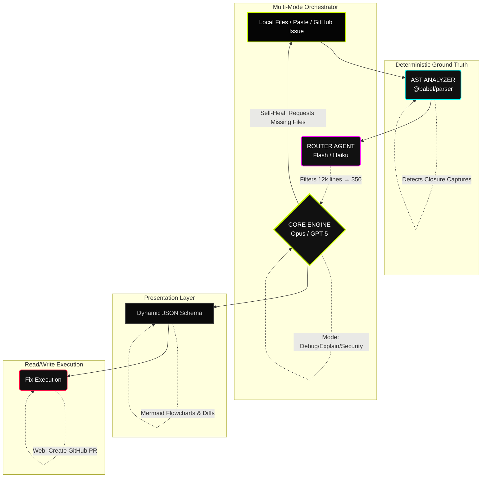

<div align="center">
  
  <h1>UNRAVEL</h1>
  <p><strong>Most AI tools can write code. Unravel is built to explain why that code broke.</strong></p>
  <h3>The Deterministic Debug Engine for AI-Generated Code</h3>
  
  <p>
    <a href="#-quick-start"></a>
    <a href="#-vs-code-extension--live-bug-lens"></a>
    <a href="LICENSE"></a>
  </p>
</div>

---

## 💥 The Problem

You paste your code into ChatGPT.

It suggests a fix.

You try it.

Now something else breaks.

So you paste the new error.

It suggests another fix.

Three hours later you've applied 14 patches and the original bug is still there.

Welcome to the **AI debugging loop**.

It happens because most AI coding tools don't actually understand your program.

They don't track variable mutations.  
They don't simulate execution.  
They don't follow state across files.

They pattern-match symptoms and guess fixes.

Sometimes the guess works.

Often it doesn't.

**Unravel breaks that loop.**

> **Language Support:** JavaScript and TypeScript only (AST pre-analysis uses `@babel/parser`). Python and other languages planned for future phases.

---

## ⚡ A Real Example

Buggy code:

```javascript
function pause(){
    clearInterval(interval)
    interval = null
    duration = remaining
}
```

The bug:

🔴 **ROOT CAUSE: STATE_MUTATION**

`duration` should remain constant.  
Mutating it causes the timer to drift after pause/resume.

Minimal fix:

```javascript
function pause(){
    clearInterval(interval)
    interval = null
    remaining = duration
}
```

This is the level of precision Unravel brings to your editor.

---

## ⚡ VS Code Extension — Live Bug Lens

The feature that changes everything. Bugs appear **directly in the code editor** — no copy-paste, no leaving the IDE.

```javascript
function pause(){
    clearInterval(interval)
    interval = null
    duration = remaining   // 🔴 ROOT CAUSE: STATE_MUTATION
                           //    duration should remain constant
}
```

**Right-click → "Unravel: Debug This File"** and the engine:

1. 🔍 **Resolves imports** — automatically pulls in dependent files (2 levels deep)
2. 🌳 **AST pre-analysis** — deterministic variable mutation chains, closures, timing nodes
3. 🧠 **AI diagnosis** — 8-phase pipeline with anti-sycophancy guards
4. ✨ **Inline results** — red squiggly underlines, `🔴 ROOT CAUSE` overlays, hover tooltips, sidebar report

```
Chat debugging: read → remember → search → verify → fix  (5 steps)
Live Bug Lens:  right-click → see bug → fix               (3 steps)
```

Works in **VS Code, Cursor, Windsurf** — anywhere VS Code extensions run.

### Install

1. Download [`unravel-vscode-0.1.0.vsix`](https://github.com/EruditeCoder108/UnravelAI/releases) from Releases
2. VS Code → Extensions (`Ctrl+Shift+X`) → `⋯` → **Install from VSIX...**
3. Right-click any `.js` file → **"Unravel: Debug This File"**

> See [full setup guide](#-how-to-use-the-vs-code-extension) below for details.

---

## ⚙️ How It Works

Unravel runs your code through an **8-phase deterministic pipeline** — the same systematic process a senior engineer uses, but faster:

```text
Phase 1  INGEST          Read all code. Build complete mental model. No theories yet.
Phase 2  TRACK STATE     Map every variable: where declared, where read, where mutated.
Phase 3  SIMULATE        Mentally execute the user's exact sequence of actions.
Phase 4  INVARIANTS      What conditions MUST hold? Which are violated?
Phase 5  ROOT CAUSE      Identify the exact file, line, variable, and function.
Phase 6  MINIMAL FIX     Smallest surgical change. Not a rewrite.
Phase 7  AI LOOP         Why do ChatGPT / Cursor / Copilot fail on this specific bug?
Phase 8  CONCEPT         What programming concept does this bug teach?
```

Every phase builds on the last. The model cannot skip to conclusions.

---

## 🏗 Architecture



---

## What Makes It Different

|   | ChatGPT / Copilot | Unravel |
|---|-------------------|---------| 
| **Analysis Method** | Symptom-based guessing | 9-phase deterministic pipeline |
| **Context Handling** | File-level context dumps | Function-level AST slicing |
| **Hallucination** | Frequent "plausible" invention | Anti-Sycophancy guards (proof required) |
| **Confidence** | Confidently wrong / Generic | Evidence-backed (Verified vs Uncertain) |
| **Fix Quality** | Full-file rewrites | Minimal surgical fix |
| **Action Center** | Copy-paste only | Natively generates PRs / Split-pane IDE patches |
| **Teaching** | "Here is the code" | Concept extraction & learning paths |
| **AI Awareness** | Zero self-reflection | "Why AI Loops" loop analysis |
| **Bug Classification** | Free-text | Formal 12-category taxonomy |

---

# 🧠 How Unravel Actually Finds Bugs

## ⚙️ How It Worksi-Sycophancy Engine

Most AI tools have a fatal flaw: they will **invent bugs that don't exist** just to appear helpful. If you say "I think the error is on line 10," they'll agree — even if line 10 is perfectly fine.

Unravel's engine has 5 hardcoded guards against this:

```
1. If the code is correct, say "No bug found." Do NOT invent problems.
2. If the user's description contradicts the code, point out the contradiction.
3. If uncertain, say "Cannot confirm without runtime execution."
4. Every bug claim must cite exact line number + code fragment as proof.
5. Never make up code behavior that cannot be verified from provided files.
```

If the model can't point to evidence, it doesn't claim the bug. Period.

---

## AST Pre-Analysis

Before any AI model sees the code, Unravel runs a **deterministic static analysis** using `@babel/parser`. This produces a verified context map:

```
Relevant Functions:
  start(), pause(), tick(), setMode()

Variable Mutation Chains:
  duration
    written: pause() L69, setMode() L86
    read:    tick() L55, start() L42

Async / Timing Nodes:
  setInterval  → tick()       [L57]
  addEventListener("visibilitychange") → handler() [L110]

Closure Captures:
  tick()    captures → duration, remaining, interval
  handler() captures → isPaused, interval
```

This is injected into the prompt as **verified ground truth**. The AI cannot hallucinate about what variables exist or where they're mutated — the AST already told it.

---

## Bug Taxonomy

Every diagnosis is classified into one of 12 formal categories:

| Category | Description |
|----------|-------------|
| `STATE_MUTATION` | Variable meant to be constant is modified unexpectedly |
| `STALE_CLOSURE` | Function captures outdated variable value |
| `RACE_CONDITION` | Multiple async operations conflict on shared state |
| `TEMPORAL_LOGIC` | Timing assumptions break (drift, wrong timestamps) |
| `EVENT_LIFECYCLE` | Missing cleanup, double-binds, or wrong event order |
| `TYPE_COERCION` | Implicit type conversion causes unexpected behavior |
| `ENV_DEPENDENCY` | Code behaves differently across environments |
| `ASYNC_ORDERING` | Operations execute in wrong sequence |
| `DATA_FLOW` | Data passes incorrectly between components/files |
| `UI_LOGIC` | Visual behavior doesn't match intent |
| `MEMORY_LEAK` | Resources not released, accumulate over time |
| `INFINITE_LOOP` | Recursive or cyclic behavior creates runaway effect |

---

## Output

Unravel produces a structured report with multiple views:

### For Humans
- Plain-language explanation of what broke and why
- Real-world analogies matched to user's coding level
- Step-by-step reproduction path

### For Developers
- Root cause with exact file, line, and variable
- Variable state mutation table
- Execution timeline with bug moment highlighted
- Invariant violations
- Visual diff of the minimal fix

### For AI Tools
- A deterministic fix prompt that other AI tools (Cursor, Copilot) can use without falling into the debugging loop
- Structured JSON output for programmatic consumption

### Concept Extraction
- What programming concept this bug teaches
- The pattern to avoid forever
- A 5-15 minute learning path to build understanding

---

## Supported Models

| Provider | Models | Tier |
|----------|--------|------|
| **Anthropic** | Claude Opus 4.6, Claude Sonnet 4.6, Claude Haiku 4.5 | Recommended |
| **Google** | Gemini 3.1 Pro Preview, Gemini 3 Flash, Gemini 2.5 Flash | Supported |
| **OpenAI** | GPT 5.3 Instant | Supported |

**BYOK** (Bring Your Own Key) — your API keys are stored locally and sent only to the provider's API endpoint. No intermediary server. No data collection.

---

## Metrics

Three numbers define whether Unravel is working:

| Metric | Definition | Target |
|--------|-----------|--------|
| **RCA** | Root Cause Accuracy — did it find the *real* bug, not a plausible guess? | 85%+ |
| **TTI** | Time To Insight — how fast does the user *understand* the bug? | < 2 min |
| **HR** | Hallucination Rate — did it reference code/variables/behavior that doesn't exist? | < 5% |

### Benchmark Results

| Configuration | RCA Score | Hallucination Rate |
|---|---|---|
| Standard prompting (no pipeline) | _pending_ | _pending_ |
| + 9-phase deterministic pipeline | _pending_ | _pending_ |
| + AST pre-analysis context | _pending_ | _pending_ |

> The 10-bug proxy benchmark exists only to validate architectural improvements during development. Public claims rely exclusively on the extended 50-bug benchmark (Phase 7).

> Run `node benchmarks/runner.js --provider google --model gemini-2.5-flash --key YOUR_KEY` to generate these numbers. Results are saved to `benchmarks/results.json`.

---

## Roadmap

### Phase 1 — Deep Thinking `COMPLETE`
BYOK multi-provider support. SOTA models with extended thinking. 8-phase deterministic prompt. Anti-sycophancy guardrails. Evidence-backed confidence. Provider-specific prompt formatting. Concept extraction. Bug taxonomy. "Why AI Loops" analysis.

### Phase 2 — The Proof `COMPLETE`
Client-side AST analysis with `@babel/parser`. Variable mutation chains, timing node detection, closure capture tracking. 10-bug benchmark suite with `benchmarks/runner.js`. Pipeline tested end-to-end with Gemini 2.5 Flash.

### Phase 3 — Core Engine + VS Code Extension `COMPLETE`
Extracted shared engine into `src/core/` — `orchestrate()`, `callProvider()`, barrel exports. Zero React dependencies. Built the **VS Code Extension** with Live Bug Lens: inline overlays, diagnostics, hover tooltips, and sidebar report panel.

### Phase 3.5 — Pre-Publish Hardening `COMPLETE`
Object property mutation detection (`task.status = newStatus`) surgically added to AST. Input completeness validation added to detect silently truncated files (HTML, JS, CSS) before reasoning begins.

### Phase 3.6 — File Handling Hardening `COMPLETE`
Router-first GitHub repo import (picks relevant files before downloading). Support for empty-symptom scanning in both Web App and VS Code Extension.

### Phase 4A — Analysis Modes & Output Control `COMPLETE`
Transformed from a single-mode debugger to a multi-mode platform. 
New modes: **Debug**, **Explain**, and **Security Scan** with unique dynamic schemas. 
Added **Mermaid Chart generation** (Timeline, Hypothesis, Data Flow, Dependency, AI Loop).
Output presets (Quick Fix vs Full Report) added. 
Web App UX complete visual redesign (5-step flow). 
VS Code Extension updated to v0.3.0 with complete multi-mode reporting and self-healing.

### Phase 4B — Intelligence Layer `PLANNED`
Symptom-independent AST scan, explicit hypothesis elimination scoring, symptom contradiction check. Function-level code slicing. **Adversarial multi-agent debate** — three agents independently diagnose the same bug and attack hypotheses. Variable Trace UI and Visual diff output. *(Note: **Self-Healing Context** — where the engine automatically fetches missing files from GitHub mid-analysis — was ✅ **BUILT EARLY**).*

### Phase 5 — GitHub Integration & Action Center `COMPLETE`
- **GitHub Issue URL Parsing:** Paste a GitHub issue URL, and Unravel automatically fetches the issue body, comments, and related context to use as the debugging symptom.
- **Security Attack Vector Flowcharts:** Security Scan mode generates Mermaid flowcharts explaining exact attack vectors and exploitation flows visually.
- **Action Center (Web App):** Generate a Git patch, copy the fix to CLI, or create a Pull Request directly after an analysis completes.
- **Action Center (VS Code):** Non-destructive **Apply Fix Locally** opens split-pane diffs for review, and **Give Fix to AI** passes the analysis directly to VS Code's built-in Copilot Chat.

---

##  Multi-Platform

```
@unravel/core              ← shared engine
  ├── unravel-v3           ← React web app
  ├── unravel-vscode       ← VS Code extension + Live Bug Lens
  ├── unravel-cli          ← terminal tool (CI/CD)
  └── unravel-desktop      ← Electron app
```

| Platform | What It Does | Status |
|----------|-------------|--------|
| **Web App** | Paste code, describe bug, get structured report | ✅ Live on Netlify |
| **VS Code Extension** | Right-click → debug. Inline overlays, hover, sidebar | ✅ Working |
| **CLI** | `unravel analyze ./src --symptom "..."` | 🔜 Phase 5 |
| **Desktop App** | Drag-and-drop folders, native file access | 🔜 Phase 5 |

---

## 🚀 How to Use the VS Code Extension

### Prerequisites

- **VS Code**, **Cursor**, or **Windsurf**
- An API key from one of: [Google AI Studio](https://aistudio.google.com/apikey) (free), [Anthropic](https://console.anthropic.com/), or [OpenAI](https://platform.openai.com/api-keys)

### Option A — Download & Install (Recommended)

1. Go to [**Releases**](https://github.com/EruditeCoder108/UnravelAI/releases) and download `unravel-vscode-0.1.0.vsix`
2. Open VS Code → Extensions panel (`Ctrl+Shift+X`)
3. Click `⋯` (top-right) → **Install from VSIX...** → select the downloaded file
4. Done. Restart VS Code if prompted.

### Option B — Build from Source

```bash
git clone https://github.com/EruditeCoder108/UnravelAI.git
cd UnravelAI/unravel-vscode
npm install
npm run build
```

Then press **F5** to launch the Extension Development Host for testing.

### Using the Extension

1. **Open any `.js` or `.ts` file** in VS Code
2. **Right-click** anywhere in the editor
3. Click **"Unravel: Debug This File"**
4. **Enter your API key** (first time only — saved to settings, you won't be asked again)
5. **Describe the bug** in one sentence, e.g. `Timer shows wrong value after pause/resume`
6. Wait 10-30 seconds...

### What You'll See

After analysis completes, **four layers activate simultaneously**:

| Layer | What You See |
|-------|-------------|
| **Red squiggly underlines** | Bug lines get error/warning underlines in the editor |
| **Inline overlays** | `🔴 ROOT CAUSE: STATE_MUTATION` appears after the buggy line |
| **Hover tooltips** | Hover any red line → tooltip with fix, confidence, and evidence |
| **Sidebar report** | Full HTML report opens in a panel beside your code |

### Settings

Open Settings (`Ctrl+,`) → search "unravel":

| Setting | Default | Options |
|---------|---------|---------|
| `unravel.apiKey` | *(empty)* | Your API key |
| `unravel.provider` | `google` | `google`, `anthropic`, `openai` |
| `unravel.model` | `gemini-2.5-flash` | Any model from your provider |

> 🔒 Keys are stored locally in VS Code `settings.json`. Never sent anywhere except the API provider.

### Works in Cursor & Windsurf

The extension works everywhere VS Code extensions run. Same steps.

---

## 🌐 How to Use the Web App

### Run Locally

```bash
cd UnravelAI/unravel-v3
npm install
npm run dev
```

Open `http://localhost:3000`. Or use the live version on Netlify.

### Three Ways to Input Code

| Tab | How It Works |
|-----|-------------|
| **Folder Upload** | Upload a project folder. AI router selects relevant files automatically. |
| **Raw Paste** | Paste code blocks manually with filenames. |
| **GitHub Import** | Paste a public repo URL or a **GitHub Issue URL** → files/context are fetched automatically. |

Enter your API key → describe the bug → run the engine → choose your output view.

---

## Project Structure

```
UnravelAI/
├── unravel-v3/                  Web application
│   ├── src/
│   │   ├── core/                Shared engine (zero React dependencies)
│   │   │   ├── index.js         Barrel export for all core modules
│   │   │   ├── config.js        Providers, taxonomy, prompts, output schema
│   │   │   ├── ast-engine.js    @babel/parser AST pre-analysis
│   │   │   ├── parse-json.js    Robust LLM JSON parser
│   │   │   ├── provider.js      API caller with retry logic
│   │   │   └── orchestrate.js   Full analysis pipeline
│   │   ├── App.jsx              5-step UI + engine integration
│   │   ├── index.css            Neo-brutalist design system
│   │   └── main.jsx             Entry point
│   └── benchmarks/
│       ├── bugs/                10 intentional bugs with ground truth
│       ├── runner.js            Benchmark runner (RCA + HR scoring)
│       └── results.json         Saved benchmark results
│
└── unravel-vscode/              VS Code extension
    ├── src/
    │   ├── extension.js         Command registration + orchestration
    │   ├── imports.js           Import resolution (depth 2)
    │   ├── diagnostics.js       Red squiggly underlines
    │   ├── decorations.js       Inline 🔴 ROOT CAUSE overlays
    │   ├── hover.js             Tooltip with fix + confidence
    │   ├── sidebar.js           Full HTML report panel
    │   └── core/                Engine (copied from unravel-v3)
    └── out/extension.js         Bundled output (esbuild)
```

---

## The Goal

Debugging shouldn't feel like guessing.

If AI can generate code, it should also help us **understand it.**

Unravel exists to make that possible.

---

## Author

Created and maintained by **Sambhav Jain**.
* **Location:** Jabalpur (M.P), INDIA
* **Contact:** [Eruditespartan@gmail.com](mailto:Eruditespartan@gmail.com)

If you have questions, feedback, or want to discuss the project, feel free to email me.

---

## Citation

If you use Unravel AI in your research or project, please cite it using the included `CITATION.cff` file, or use the following BibTeX:

```bibtex
@software{Jain_Unravel_AI,
  author = {Jain, Sambhav},
  title = {Unravel AI: Deterministic Pre-Analysis and Hypothesis Elimination Engine},
  url = {https://github.com/EruditeCoder108/UnravelAI},
  year = {2024}
}
```

---

## License

Released under the [Business Source License 1.1 (BSL-1.1)](LICENSE).
