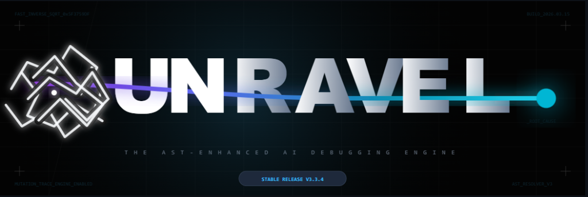

# Unravel — Causal AI Debugger



> **Deterministic AST Analysis. Causal Reasoning. Exact Fixes.**
> The first VS Code extension that runs a structural code analysis pass before any AI sees your code.

---

## What Is Unravel?

Most AI debugging tools feed your code directly to a language model and hope for the best. Unravel does something different.

Before any AI involvement, Unravel runs a **Tree-Sitter AST analysis pass** on your code. It extracts verified, deterministic facts about your codebase — mutation chains, async yield boundaries, cross-file variable flows, closure captures, React hook patterns — and injects them as ground truth into the AI's context.

The result: the AI reasons over facts, not guesses.

---

## Features

### Three Analysis Modes

| Mode | What It Does |
|------|-------------|
| **Debug** | Locates root causes using hypothesis elimination, causal chain tracing, and AST-verified evidence. |
| **Explain** | Produces a causal walkthrough of complex code — how data flows, what each layer does, why the architecture is shaped this way. |
| **Security** | Scans for vulnerabilities using project-wide static analysis. Confidence-gated — low-certainty findings are downgraded automatically. |

### AST Engine Capabilities
- **Mutation chains** — tracks every variable write/read across files, with conditional context
- **Async yield detection** — flags global state mutations before `await` calls (race conditions)
- **Cross-file variable flows** — traces identifiers across module boundaries
- **React patterns** — stale closures, missing cleanup, unstable `useMemo`/`useCallback` deps
- **Floating promises** — unhandled async calls that silently swallow errors
- **Listener parity** — `addEventListener` without matching `removeEventListener`

### Editor Integration
- **Inline diagnostics** — red/yellow squiggles on the exact bug lines with evidence
- **Gutter decorations** — root cause and causal chain overlays directly in code
- **Hover cards** — detailed evidence on hover for every flagged line
- **Streaming report panel** — live glassmorphic sidebar populates as analysis runs
- **Self-healing** — automatically fetches missing dependency files from the workspace

---

## Installation

### From GitHub (Recommended)
1. Download `unravel-vscode-x.x.x.vsix` from [Releases](https://github.com/EruditeCoder108/UnravelAI/releases)
2. In VS Code: `Ctrl+Shift+P` → **Extensions: Install from VSIX...**
3. Select the downloaded file

### From Source
```bash
git clone https://github.com/EruditeCoder108/UnravelAI
cd unravel-vscode
npm run package
# Then install the generated .vsix from VS Code
```

---

## Setup

Open VS Code Settings (`Ctrl+,`) and configure:

| Setting | Description |
|---------|-------------|
| `unravel.apiKey` | Your API key — Gemini, Claude, or OpenAI |
| `unravel.provider` | `google` / `anthropic` / `openai` |
| `unravel.model` | Model ID (e.g. `gemini-2.5-flash`, `claude-sonnet-4-5`) |
| `unravel.outputPreset` | `quick` (root cause only) · `developer` (+ variables + timeline) · `full` |
| `unravel.level` | `beginner` · `intermediate` · `vibe` — adjusts explanation depth |
| `unravel.language` | `english` · `hinglish` · `hindi` |

---

## Usage

**Right-click** anywhere in an open JS/TS/JSX/TSX file → select the mode:

- **Unravel: Debug This File** — find bugs
- **Unravel: Explain This File** — understand code
- **Unravel: Security Scan This File** — find vulnerabilities
- **Unravel: Clear Diagnostics** — dismiss all squiggles (`Ctrl+Shift+P`)

Or use the Command Palette (`Ctrl+Shift+P`) and search `Unravel`.

---

## How It Works

```
Your Code
    │
    ▼
Tree-Sitter AST Pass          ← runs locally, no network
(mutations, async gaps,
 closures, React patterns)
    │
    ▼
Verified Ground Truth Block   ← injected into AI context
    │
    ▼
AI Hypothesis Tree            ← generates + eliminates hypotheses
    │
    ▼
Claim Verifier                ← checks AI output against AST facts
    │
    ▼
Report + Editor Overlays      ← root cause, fix, causal chain
```

The AST pass runs in WASM (Tree-Sitter) entirely in your local VS Code process. No source code leaves your machine until the AI call — and even then, only the files relevant to the analyzed file are sent.

---

## Benchmark

Unravel was validated on a 21-bug benchmark (B-01 through B-20 + one extreme-difficulty "super-bug") covering race conditions, async ordering bugs, React rendering issues, ESM/CJS conflicts, keyboard layout dependencies, and multi-tenant data leakage.

| System | Score | Notes |
|--------|-------|-------|
| Unravel (AST + Gemini 2.5 Flash) | **125/126 (99.2%)** | — |
| Claude Sonnet 4.x (structured prompt, no AST) | **118/126 (93.7%)** | B-01–B-11 used unstructured prompt |

On the last 10 bugs (structured prompt for both): **Unravel 59/60, Claude 60/60** — effectively equivalent. The AST engine closes the reasoning gap between a fast, cheap model and a frontier reasoning model.

---

## Supported Languages

Full AST analysis: **JavaScript, TypeScript, JSX, TSX**

Explain and Security modes also support: **Python, CSS, HTML**

---

## Architecture

- **AST Engine** — Tree-Sitter WASM, runs in-process
- **Orchestrator** — 6-phase pipeline: graph routing → AST → prompt build → AI call → claim verification → solvability check
- **Claim Verifier** — validates every line/file reference the AI makes against the actual source
- **Self-Heal Loop** — if AI requests additional files, the extension fetches them from the workspace and re-runs (up to 2 iterations)
- **Layer Boundary Detection** — identifies when the bug is upstream of the provided codebase (OS/browser/layout layer) and surfaces this instead of generating a wrong fix

---

## License

BUSL-1.1 — free for non-commercial use. [Full license](../LICENSE)

---

[GitHub](https://github.com/EruditeCoder108/UnravelAI) · [Report a Bug](https://github.com/EruditeCoder108/UnravelAI/issues) · [Research Paper](https://github.com/EruditeCoder108/UnravelAI/blob/main/arXiv-paper.pdf)
