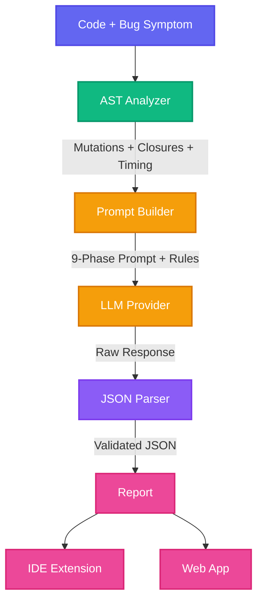
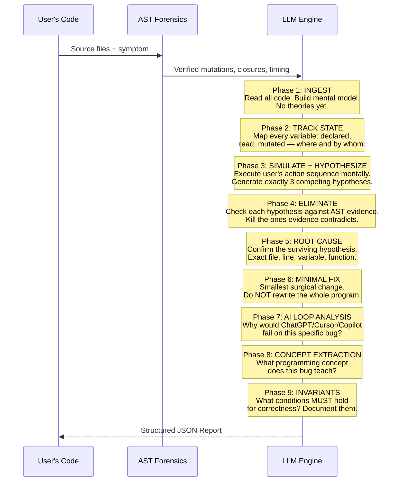
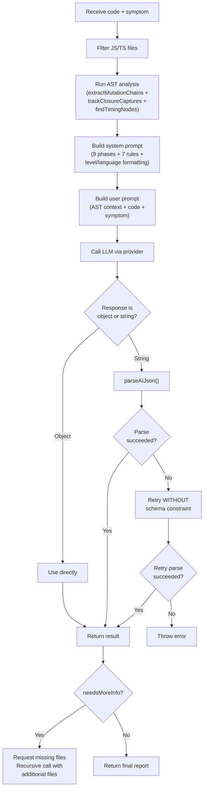
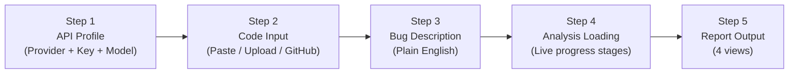
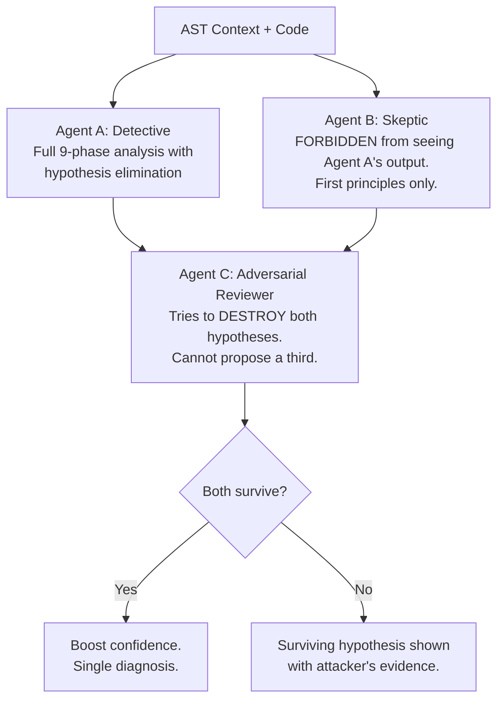

# UNRAVEL — The Complete Blueprint
### *Most AI tools can write code. Unravel is built to explain why that code broke.*

> **AI Code Generation is solved. AI Code Understanding is not. Unravel fixes that.**

---

# Table of Contents

1. [The Problem We Solve](#1-the-problem-we-solve)
2. [The Crime Scene Analogy](#2-the-crime-scene-analogy)
3. [Design Principles](#3-design-principles)  
4. [System Architecture](#4-system-architecture)
5. [The AST Pre-Analysis Engine (Layer 0)](#5-the-ast-pre-analysis-engine-layer-0)
6. [The 9-Phase Deterministic Pipeline](#6-the-9-phase-deterministic-pipeline)
7. [Anti-Sycophancy Guardrails](#7-anti-sycophancy-guardrails)
8. [Bug Taxonomy](#8-bug-taxonomy)
9. [The Output Schema](#9-the-output-schema)
10. [Provider Architecture](#10-provider-architecture)
11. [The Core Engine — `orchestrate()`](#11-the-core-engine--orchestrate)
12. [The VS Code / Cursor / Windsurf Extension](#12-the-vs-code--cursor--windsurf-extension)
13. [The Web Dashboard](#13-the-web-dashboard)
14. [Benchmark Testing & Proof](#14-benchmark-testing--proof)
15. [How to Use Unravel](#15-how-to-use-unravel)
16. [Future Roadmap — Phases 4 through 7](#16-future-roadmap--phases-4-through-7)
17. [The API Play — Long-Term Vision](#17-the-api-play--long-term-vision)

---

# 1. The Problem We Solve

You paste your code into ChatGPT. It suggests a fix. You try it. Now something else breaks. You paste the new error. It suggests another fix. Three hours later you've applied 14 patches and the original bug is still there.

**This is called the "AI Debugging Loop."**

It happens because most AI coding tools don't actually understand your program:

- They don't track which variables changed and when.
- They don't simulate what happens step by step.
- They don't follow state across multiple files.

They pattern-match symptoms and guess fixes. Sometimes the guess works. Often it doesn't.

**Unravel breaks that loop.** Instead of guessing, it collects deterministic evidence from your code *before* it asks an AI to reason. It forces the AI through a strict analytical pipeline. The result: exact file, exact line, exact variable — with proof.

---

# 2. The Crime Scene Analogy

Think of debugging like investigating a crime in a mansion.

### How ChatGPT / Copilot / Cursor debug:
You're a detective who never visits the crime scene. You call a witness (the AI) and ask, *"Who did it?"* The witness guesses based on the building's blueprints: *"Usually, the butler does it. Try arresting the butler."* It's a guess based on statistical probability. No physical evidence.

### How Unravel debugs:
Unravel sends a **forensics team** into the mansion *before* anyone talks to the detective.

```
Step 1: Tape off the room
        → Parse the code into an Abstract Syntax Tree (AST).

Step 2: Dust for fingerprints
        → Extract every variable, where it was written, where it was read,
          and by which function (Variable Mutation Chains).

Step 3: Check the security cameras
        → Map every setTimeout, setInterval, fetch(), Promise.then(),
          and addEventListener — the exact order things happened
          (Timing Nodes).

Step 4: Check who had keys to which rooms
        → Identify every function that "remembers" a variable from
          outside itself, and whether that memory went stale
          (Closure Captures).
```

Only *after* the forensics report is compiled does Unravel hand the file to the lead detective (the LLM). The LLM is no longer guessing. It is reviewing **hard evidence** and declaring an exact root cause.

**Unravel replaces probabilistic guessing with deterministic proof.**

---

# 3. Design Principles

Every decision in Unravel flows from these five rules:

| # | Principle | What It Means |
|---|-----------|--------------|
| 1 | **Deterministic facts before AI reasoning** | The AST forensics pass runs first. The AI receives verified ground truth, not a blank canvas. |
| 2 | **Evidence required for every claim** | No bug claim without exact line number + code fragment. No exceptions. |
| 3 | **Eliminate wrong hypotheses, don't guess at right ones** | Generate multiple explanations, then kill the ones the evidence contradicts. The survivor is the diagnosis. |
| 4 | **Never hide uncertainty** | "Uncertain" is better than "confident-wrong." If 2 of 3 hypotheses survive elimination, say so. |
| 5 | **Optimize for developer understanding, not impressive output** | The goal is insight, not a longer report. |

---

# 4. System Architecture

## High-Level Data Flow



## File Architecture

```
unravel-v3/src/core/          ← The Engine (zero React/browser dependencies)
├── index.js                   ← barrel export
├── config.js                  ← providers, taxonomy, prompts, schema (333 lines)
├── ast-engine.js              ← @babel/parser analysis (424 lines)
├── parse-json.js              ← robust JSON parser with fallbacks (98 lines)
├── provider.js                ← API calling + retry logic (78 lines)
└── orchestrate.js             ← full pipeline as single async function (120 lines)

unravel-v3/src/                ← The Web App (React/Vite)
├── App.jsx                    ← main UI with 5-step flow (922 lines)
├── main.jsx                   ← entry point
└── index.css                  ← premium dark theme

unravel-vscode/                ← The IDE Extension
├── package.json               ← extension manifest
├── esbuild.js                 ← ESM→CJS bundler
└── src/
    ├── extension.js           ← activate(), command handler, status bar
    ├── imports.js             ← resolve ESM/CJS imports (depth 2)
    ├── diagnostics.js         ← red squiggly underlines on bug lines
    ├── decorations.js         ← inline 🔴 ROOT CAUSE overlay text
    ├── hover.js               ← tooltip with fix + confidence on hover
    ├── sidebar.js             ← full HTML report WebView panel
    └── core/                  ← bundled copy of the core engine

benchmarks/                    ← 10-Bug Development Proxy
├── runner.js                  ← automated benchmark runner
├── bugs/                      ← 10 deliberately buggy programs
└── results.json               ← benchmark output

bugcode1-7/                    ← 7 Stand-Alone Buggy Apps (blind test suite)
```

---

# 5. The AST Pre-Analysis Engine (Layer 0)

This is the heart of what makes Unravel fundamentally different from every other AI debugging tool. Before any LLM sees a single character of code, the AST engine extracts **verified, deterministic facts**.

The engine uses `@babel/parser` to parse JavaScript/TypeScript into an Abstract Syntax Tree, then `@babel/traverse` to walk the tree and extract three categories of evidence:

## 5.1 — Variable Mutation Chains (`extractMutationChains`)

Walks every `AssignmentExpression` and `UpdateExpression` node. Records:
- **Variable name**
- **Line number**
- **Enclosing function** (using `getEnclosingFunction()` which walks up the AST parent chain)
- **Direction:** write or read

Also handles destructuring patterns (`[a, b] = ...` and `{ a, b } = ...`).

For reads, it tracks every `Identifier` usage while skipping noise (declarations, import specifiers, property access keys, common globals like `console`, `window`, `document`).

**Example output:**
```
Variable Mutation Chains:
  duration
    written: pause() L69, setMode() L86
    read:    tick() L55, start() L42
  remaining
    written: start() L42, tick() L56, pause() L70
    read:    tick() L55, pause() L69, reset() L79
```

## 5.2 — Closure Captures (`trackClosureCaptures`)

Walks every `FunctionDeclaration`, `FunctionExpression`, and `ArrowFunctionExpression`. For each function:
1. Gets the function's own scope bindings via Babel's `scope` API.
2. Walks all `Identifier` nodes inside the function body.
3. If an identifier is **not** in the function's own scope but **is** bound in an outer scope → it's a **captured variable**.

This detects stale closures — the #1 hardest bug class in JavaScript — automatically.

**Example output:**
```
Closure Captures:
  tick()    captures → duration, remaining, interval
  handler() captures → isPaused, interval
```

## 5.3 — Timing / Async Nodes (`findTimingNodes`)

Walks every `CallExpression` and checks if the callee matches a curated set of async APIs:

```javascript
const TIMING_APIS = new Set([
    'setTimeout', 'setInterval', 'clearInterval', 'clearTimeout',
    'addEventListener', 'removeEventListener',
    'requestAnimationFrame', 'cancelAnimationFrame',
    'fetch', 'then', 'catch', 'finally',
]);
```

For each match, it records:
- The API name (e.g., `setTimeout`, `addEventListener("click")`)
- The callback name or type (`(arrow)`, `(inline handler)`, named function)
- The line number
- The enclosing function

Handles direct calls (`setTimeout(...)`), method calls (`window.setTimeout(...)`), and Promise chains (`.then(...)`, `.catch(...)`).

**Example output:**
```
Async / Timing Nodes:
  setInterval  → tick()         [L57]
  addEventListener("visibilitychange") → handler()  [L110]
  setTimeout   → (arrow)        [L7]
```

## 5.4 — Integration (`runFullAnalysis`)

All three extractors are combined into a single function that:
1. Parses the code (with fallback from `module` mode to `script` mode if parsing fails)
2. Runs all three extractors
3. Formats the output as a human-readable string
4. Returns both the raw data and the formatted string

The formatted string is prefixed with:
```
VERIFIED STATIC ANALYSIS — deterministic, not hallucinated
══════════════════════════════════════════════════════════
```

This is injected directly into the LLM prompt as **ground truth**. The AI cannot hallucinate about what variables exist or where they're mutated — the AST already told it.

---

# 6. The 9-Phase Deterministic Pipeline

The LLM is forced through these phases in strict order. It cannot skip to conclusions.



### The Critical Innovation: Phases 3-4 (Hypothesis Elimination)

This is the key architectural improvement over the original 8-phase pipeline. Instead of committing to a single explanation early (which leads to "confident-wrong" output), the model:

1. **Generates 3 competing hypotheses** for the root cause.
2. **Tests each one** against the AST evidence.
3. **Kills** any hypothesis the evidence contradicts.
4. If 2+ hypotheses survive → marks the diagnosis as **uncertain** (honest, not confident-wrong).
5. If exactly 1 survives → that is the diagnosis, backed by elimination evidence.

This mirrors the scientific method: you don't prove a theory right; you try to prove it wrong, and the one you can't break is the one you keep.

---

# 7. Anti-Sycophancy Guardrails

AI models are trained to be agreeable. If you say *"I think the bug is on line 50,"* they'll often validate that even if line 50 is perfectly fine. Unravel hardcodes **7 rules** that override sycophancy:

| # | Rule |
|---|------|
| 1 | NEVER make up code behavior you cannot verify from provided files. |
| 2 | If the code appears CORRECT and the bug cannot be reproduced, say so clearly. Do NOT invent bugs to appear useful. |
| 3 | If the user's bug description contradicts the actual code behavior, point out the contradiction. |
| 4 | If uncertain, say "Cannot confirm without runtime execution" — do NOT guess and present as fact. |
| 5 | Every bug claim MUST include exact line number + code fragment as proof. |
| 6 | Generate at least 3 competing hypotheses before committing. Do not anchor to the first plausible explanation. |
| 7 | If multiple hypotheses survive elimination, report ALL survivors with evidence. Do NOT pick one arbitrarily. |

Rules 6-7 are the **hypothesis elimination guards** — they prevent the model from anchoring to its first guess.

---

# 8. Bug Taxonomy

Every diagnosis is classified into one of **12 formal categories**. No free-text bug types.

| Category | What It Means | Color |
|----------|--------------|-------|
| `STATE_MUTATION` | Variable meant to be constant is modified unexpectedly | `#ff003c` |
| `STALE_CLOSURE` | Function captures outdated variable value | `#ff6b6b` |
| `RACE_CONDITION` | Multiple async operations conflict on shared state | `#e040fb` |
| `TEMPORAL_LOGIC` | Timing assumptions break (drift, wrong timestamps) | `#ffaa00` |
| `EVENT_LIFECYCLE` | Missing cleanup, double-binds, or wrong event order | `#ff9100` |
| `TYPE_COERCION` | Implicit type conversion causes wrong behavior | `#7c4dff` |
| `ENV_DEPENDENCY` | Code behaves differently across environments | `#00e5ff` |
| `ASYNC_ORDERING` | Operations execute in wrong sequence | `#00bfa5` |
| `DATA_FLOW` | Data passes incorrectly between components/files | `#448aff` |
| `UI_LOGIC` | Visual behavior doesn't match intent | `#69f0ae` |
| `MEMORY_LEAK` | Resources not released, accumulate over time | `#ff5252` |
| `INFINITE_LOOP` | Recursive or cyclic behavior creates runaway effect | `#ff1744` |

Formal taxonomy means diagnoses are machine-readable, comparable across runs, and can be aggregated for benchmark analysis.

---

# 9. The Output Schema

Every analysis produces a single JSON object consumed by all UI surfaces:

```json
{
  "needsMoreInfo": false,
  "report": {
    "bugType":          "STATE_MUTATION",
    "confidence":       0.92,
    "symptom":          "Timer shows wrong value after pause/resume",
    "reproduction":     ["Start timer", "Let run 10s", "Pause", "Reset → wrong"],
    "evidence":         ["duration mutated at pause() L69 — confirmed by AST"],
    "uncertainties":    ["Cannot verify visibilitychange without runtime"],
    "rootCause":        "duration variable mutated in pause() at line 69",
    "codeLocation":     "script.js line 69",
    "minimalFix":       "Remove duration = remaining from pause(). Add separate variable.",
    "whyFixWorks":      "Preserving duration as immutable config means reset() returns to correct length.",
    "variableState":    [{ "variable": "duration", "meaning": "Total session length",
                           "whereChanged": "pause() L69, setMode() L86" }],
    "timeline":         [{ "time": "T0", "event": "start() — duration=1500" },
                          { "time": "T+10s", "event": "pause() — duration mutated to 1490 ⚠️" },
                          { "time": "T+15s", "event": "reset() — remaining set to 1490, not 1500" }],
    "invariants":       ["duration must remain constant for session lifetime"],
    "hypotheses":       ["Alt: visibilitychange handler not updating startTimestamp"],
    "conceptExtraction": {
      "bugCategory":    "STATE_MUTATION",
      "concept":        "Immutable Configuration Values",
      "whyItMatters":   "When config variable is mutated at runtime, all calculations break silently.",
      "patternToAvoid": "Never reassign a fixed parameter inside a runtime function.",
      "realWorldAnalogy": "Recipe mein sugar ki quantity ek baar decide hoti hai."
    },
    "whyAILooped": {
      "pattern":     "Symptom-chasing: AI focused on setInterval, not state management",
      "explanation": "AI never traced duration's lifecycle. Each error looked isolated.",
      "loopSteps":   ["User: timer ends early → AI: adds check → freezes",
                       "User: freezes → AI: adds restart → double-counts"]
    },
    "aiPrompt": "Fix the timer: preserve duration as immutable config."
  }
}
```

### Four Report Views (Web App)

| View | Audience | Content |
|------|----------|---------|
| **Human** | Vibecoders | Plain-language explanation with real-world analogies |
| **Technical** | Developers | Root cause, variable state table, timeline, invariants |
| **Agent Prompt** | AI tools | A deterministic fix prompt for Cursor/Copilot/Bolt |
| **Minimal Fix** | Everyone | The exact code change, nothing else |

---

# 10. Provider Architecture

Unravel supports three AI providers. Same content, different formatting per provider (models respond better to their native format):

| Provider | Models | Prompt Format | Why |
|----------|--------|---------------|-----|
| **Anthropic** | Claude Opus 4.6, Sonnet 4.6, Haiku 4.5 | XML tags (`<instructions>`, `<rules>`) | Trained on XML — highest fidelity |
| **Google** | Gemini 3.1 Pro, Gemini 3 Flash, Gemini 2.5 Flash | Markdown (headers, bold, bullets) | Google-recommended format |
| **OpenAI** | GPT 5.3 Instant | `###` section headers + triple-backtick delimiters | OpenAI-recommended format |

### Key Technical Details

- **BYOK (Bring Your Own Key):** API keys are stored locally and sent only to the provider's endpoint. No intermediary server. No data collection.
- **Exponential backoff retry:** 4 retries with 1.5s → 3s → 6s → 12s delays on rate limits (429) and server errors (5xx).
- **Gemini thinking budget:** `thinkingBudget: 24576` for 2.5 models, `thinkingLevel: 'high'` for 3.x models.
- **Gemini structured output:** Uses `responseMimeType: 'application/json'` + `responseSchema` for native JSON output. `maxOutputTokens: 32000` for 2.5 Flash (increased from 16000 to handle the larger 9-phase responses).
- **Automatic retry on parse failure:** If the first response is truncated or malformed, the engine automatically retries without the schema constraint, giving the model more freedom to produce valid JSON.

---

# 11. The Core Engine — `orchestrate()`

The entire Unravel pipeline is wrapped in a single async function:

```javascript
orchestrate(codeFiles, symptom, options) → Promise<Object>
```

**Parameters:**
- `codeFiles`: Array of `{ name: string, content: string }`
- `symptom`: Plain-English bug description
- `options.provider`: `'anthropic'` | `'google'` | `'openai'`
- `options.apiKey`: User's API key
- `options.model`: Model ID string
- `options.level`: `'beginner'` | `'vibe'` | `'basic'` | `'intermediate'`
- `options.language`: `'hinglish'` | `'hindi'` | `'english'`
- `options.onProgress`: Progress callback `(stage: string) => void`
- `options.onMissingFiles`: Missing files callback `(request) => Promise<Array|null>`

**Pipeline execution:**



The `parseAIJson` function is a battle-hardened JSON parser that handles:
1. Clean JSON strings (direct `JSON.parse`)
2. JSON inside markdown fences (``` ```json ... ``` ```)
3. Multiple JSON blocks (picks the one with `report` or `needsMoreInfo` keys)
4. Balanced brace matching for extracting JSON from mixed text
5. Flat response normalization (top-level fields treated as the report)

---

# 12. The VS Code / Cursor / Windsurf Extension

The extension is a shell around `orchestrate()`. It works identically in VS Code, Cursor, and Windsurf (anywhere VS Code extensions run).

### User Flow

```
Right-click any .js/.ts file → "Unravel: Debug This File"
  ↓ First time: API key prompt → saved to VS Code settings
  ↓ "Describe the bug in one sentence"
  ↓ Status bar: $(loading~spin) AST analyzing → calling AI → parsing
  ↓ Results appear simultaneously:
    • Red squiggly on root cause line (diagnostics.js)
    • 🔴 ROOT CAUSE: STATE_MUTATION inline text (decorations.js)
    • Hover → fix + confidence + evidence (hover.js)
    • Sidebar → full structured report (sidebar.js)
```

### Extension Components

| File | Responsibility |
|------|---------------|
| `extension.js` | `activate()`, registers command handler, manages status bar |
| `imports.js` | Resolves ESM/CJS imports up to 2 levels deep (prevents pulling `node_modules`) |
| `diagnostics.js` | Creates red squiggly underlines on the exact bug line |
| `decorations.js` | Renders inline `🔴 ROOT CAUSE: STATE_MUTATION` overlay text |
| `hover.js` | Shows tooltip with fix, confidence, and evidence on hover |
| `sidebar.js` | Renders full HTML report in a WebView panel |

### Key Implementation Details

- VS Code lines are **0-indexed** — line 69 in the file = index 68 in the API
- `codeLocation` is normalized to string before `.toLowerCase()` (model sometimes returns an object)
- Context menu is scoped to JS/TS only via `when` clause
- Import resolution walks depth 2 only — prevents pulling in `node_modules`
- The extension is bundled to a single `out/extension.js` (1.6MB) using esbuild

---

# 13. The Web Dashboard

A premium, dark-mode Vite/React application with rich typography and glassmorphism.

### 5-Step UI Flow



### File Input Methods

| Method | How It Works |
|--------|-------------|
| **Paste** | Paste code directly into the editor |
| **Upload** | Drag-and-drop files or folder. Appends (doesn't replace). Deduplicates by filename. |
| **GitHub Import** | Paste a public repo URL → files fetched via GitHub API → added to workspace |

### User Level System

| Level | Icon | Description |
|-------|------|-------------|
| Zero Code | 👶 | Never written code. Explain like they're 10. |
| Vibe Coder | 🎨 | Uses Cursor/Bolt/Lovable. Knows what an app *does*, not how code works. |
| Some Basics | 📖 | Knows HTML/CSS. Lost in JavaScript logic. |
| Developer | 💻 | Can code. Confused by *this specific* bug. |

### Output Languages

| Language | Style |
|----------|-------|
| **Hinglish** | "Yaar, yeh variable basically tera timer ka total time store karta hai." |
| **Hindi** | Pure Hindi with technical terms translated |
| **English** | Simple English. Zero jargon. |

---

# 14. Benchmark Testing & Proof

## The 10-Bug Development Proxy

An internal test suite with 10 deliberately buggy programs covering the bug taxonomy:

| # | Category | Bug Description |
|---|----------|----------------|
| 1 | `STALE_CLOSURE` | setInterval capturing stale state |
| 2 | `STATE_MUTATION` | Pomodoro duration overwrite |
| 3 | `RACE_CONDITION` | Two parallel API fetches overriding state |
| 4 | `EVENT_LIFECYCLE` | Missing cleanup in useEffect |
| 5 | `ASYNC_ORDERING` | Missing await |
| 6 | `TYPE_COERCION` | `"5" + 3` implicit coercion |
| 7 | `TEMPORAL_LOGIC` | Date.now() pausing issues |
| 8 | `DATA_FLOW` | Props not updating downstream component |
| 9 | `UI_LOGIC` | Object reference equality blocking render |
| 10 | `STALE_CLOSURE` | useEffect missing vital dependency |

## The 7-Bug Blind Test Suite

7 standalone buggy applications with **no spoiler comments** in the code (stripped for test purity):

| # | App | Bug Type | Difficulty | Files |
|---|-----|----------|-----------|-------|
| 1 | Pomodoro Timer | STATE_MUTATION | Medium | Single-file |
| 2 | Bank Dashboard | RACE_CONDITION | Hard | 3 files |
| 3 | Modal Dialog | EVENT_LIFECYCLE / MEMORY_LEAK | Medium | 2 files |
| 4 | Tip Calculator | TYPE_COERCION | Easy | Single-file |
| 5 | **The Heisenbug** | RACE_CONDITION / Observation Effect | **Very Hard** | 2 files |
| 6 | Temp Converter | HIDDEN_FEEDBACK_LOOP | Medium | Single-file |
| 7 | Team Roster | CACHE_DESYNC / EMERGENT | Hard | 4 files |

## 🏆 The Benchmark Proof: 4-Model Live Report

*Conducted: March 2026. Both tests run on stripped code — no inline comments, no hints, no spoilers.*

> **"Unravel gives a $0.05 model the output structure of a senior engineer's written report, consistently, on any bug, across any project size."**

Three SOTA models were used as the baseline — Claude 4.6 (Anthropic), ChatGPT 5.3 (OpenAI), and Gemini 3.1 Pro (Google, latest). Unravel ran on Gemini 2.5 Flash — the weakest, cheapest model in its supported list, free tier.

### Test 1 — The Heisenbug (Single File)

A race condition in a dashboard initializer where two async operations both mutate and render from shared state independently. The Heisenbug: adding `console.log` to debug it changes microtask scheduling just enough to make the bug disappear entirely. Observation eliminates the bug.

| Feature | Claude 4.6 | ChatGPT 5.3 | Gemini 3.1 Pro | Unravel (Flash) |
|---------|-----------|------------|---------------|----------------|
| Bug category correct | ✅ RACE_CONDITION | ✅ (called "UI sync") | ✅ RACE_CONDITION | ✅ RACE_CONDITION |
| Heisenbug correctly identified | ✅ | ❌ Dismissed | ✅ | ✅ Fully explained |
| Why console.log fixes it | ✅ | ❌ Missed mechanism | ✅ | ✅ Exact microtask mechanism |
| Spread doesn't always overwrite | ⚠️ Imprecise | ✅ Caught this | ✅ | ✅ With timing explanation |
| Correct fix (Promise.all) | ✅ | ✅ | ✅ | ✅ |
| Error handling in fix | ❌ | ❌ | ✅ | ✅ |
| **Predicted 7-step AI symptom loop** | ❌ | ❌ | ❌ | ✅ Only tool |
| **Variable state tracker** | ❌ | ❌ | ❌ | ✅ Only tool |
| **Invariants documented** | ❌ | ❌ | ❌ | ✅ 4 invariants |
| **Execution timeline** | ✅ basic | ✅ basic | ❌ | ✅ Most detailed |
| **Structured JSON output** | ❌ prose | ❌ prose | ❌ prose | ✅ Only tool |

**Key Finding:** ChatGPT 5.3 dismissed the Heisenbug completely. Gemini 3.1 Pro got the technical diagnosis right but used expensive *thinking tokens* to get there. Unravel (Flash, no thinking mode) matched all three on the technical diagnosis, then produced four things nobody else did: the 7-step AI loop trace, variable state tracker, 4 invariants, and structured JSON.

### Test 2 — The Phantom Accumulator (5 Files)

A 4-way emergent bug across 5 files: a memoization reference bug, a WeakRef GC footgun, a microtask async ordering issue, and a Heisenbug observation effect combined. The selector cache checks `===` reference equality, but the array is mutated in place.

| Feature | Claude 4.6 | ChatGPT 5.3 | Gemini 3.1 Pro | Unravel (Flash) |
|---------|-----------|------------|---------------|----------------|
| Root cause correct | ✅ | ✅ | ✅ | ✅ |
| Mutation sites with exact lines | ✅ | ✅ | ✅ | ✅ L22, L28, L32 |
| `resetBoard` noted as working | ✅ | ❌ | ❌ | ✅ explicitly |
| Offered full file rewrite | ❌ | ✅ anti-pattern | ❌ | ❌ minimal fix only |
| **Exact timestamped failure trace** | ✅ basic T0/T1/T2 | ❌ | ❌ | ✅ 0s→10.5s with ref_A notation |
| **8-step AI loop traced** | ✅ | ⚠️ surface only | ❌ | ✅ full 8 steps |
| **Variable tracker** | ❌ | ❌ | ❌ | ✅ 2 variables tracked |
| **8 invariants documented** | ❌ | ❌ | ❌ | ✅ only tool |
| **3 competing hypotheses listed** | ❌ | ❌ | ❌ | ✅ only tool |
| **Deterministic AI fix prompt** | ❌ | ❌ | ❌ | ✅ only tool |
| **Exact reproduction steps** | ❌ | ❌ | ❌ | ✅ only tool |
| **Real-world analogy** | ❌ | ❌ | ❌ | ✅ box/label analogy |

**Key Finding:** All four tools found the root cause on this 5-file architecture. The divergence is everything surrounding the diagnosis. Unravel systematically produces 8 output categories by design that no other tool produced: invariants, reproduction steps, variable tracker, fix prompt, competing hypotheses, timestamped trace, real-world analogy, and structured JSON.

### Ablation Study: The Pipeline vs The Model (Test 2)

What happens if we take the Unravel pipeline away and just ask Gemini 2.5 Flash to fix Test 2 directly?

Standalone Flash found the bug and fixed it — but chose `selectorCache.clear()` on every mutation instead of immutable updates. It works, but compare the two approaches:

**Standalone Flash fix — cache clearing:**
```javascript
state.tasks.push(task);
selectorCache.clear(); // brute force
```

**Unravel's fix — immutable updates:**
```javascript
state.tasks = [...state.tasks, task]; // reference changes
```

**Why Unravel's fix is pragmatically better:**
The entire point of `selectorCache` is to avoid recomputing all three filtered arrays on every change. Clearing it on every mutation defeats that purpose completely — you now recompute all selectors on every single state change, which is exactly what the cache was built to prevent. Unravel's fix preserves the cache's value. The cache still works — it just invalidates correctly now because the reference changes.

| Feature Output | Standalone Flash | Unravel (Flash) |
|---------------|------------------|-----------------|
| Found the bug | ✅ | ✅ |
| Fix works | ✅ | ✅ |
| **Fix preserves cache intent** | ❌ defeats the cache | ✅ |
| AI loop analysis | ❌ | ✅ |
| Invariants | ❌ | ✅ |
| Competing hypotheses | ❌ | ✅ |
| Structured output | ❌ prose + code | ✅ JSON |

The headline from this: **same model, completely different output quality.** Standalone Flash gives you a working fix that quietly breaks the performance optimization the built-in cache was designed for. Unravel gives you the correct fix, the reasoning, the invariants, the loop analysis, and the structured report.

The model isn't the differentiator. The pipeline is.

### The "Second Run" Revelation: Symptom-Driven Analysis

During testing, we ran the exact same 5 files for Test 2 through Unravel *a second time*, but changed the symptom description. 
- **First run symptom:** "Tasks don't appear after adding." 
- **Second run symptom:** "Statistics not displayed, rapid add causes flickering and log spam."

**The result:** The second run found **three root causes**. Two were confirmed real. One was a conditionally correct observation flagged with explicit uncertainty due to input truncation.

| Finding | Status |
|---------|--------|
| Cache invalidation (same as run 1) | ✅ Real, correctly diagnosed |
| Redundant renders on Rapid Add | ✅ Real, correctly diagnosed |
| Missing HTML elements | ⚠️ Conditionally correct observation + Uncertainty flag |

**The real finding — Redundant Render Batching:** Clicking "Rapid Add x5" fired 5 synchronous mutations, which scheduled 5 separate `emit()` calls into the microtask queue. The microtask executed all 5 sequentially, causing 5 useless DOM renders for one logical action. The `queueStateChangeEmit` fix Unravel proposed — using a `stateChangePending` flag to ensure only one emit fires per microtask — is genuinely better engineering than what any model proposed in round one.

**The "False Positive" that wasn't — Input Context Limitation:** Unravel reported that `renderStats` references DOM IDs (`stat-highpri`, `count-todo`, etc.) that do not appear in `index.html`. It turns out the HTML file had been truncated during context ingestion before the statistics bar was included.

However, Unravel did not blindly assert those elements were missing. It flagged the claim as uncertain in the Confidence Evidence section:

> *"The provided `bugcode8/index.html` file is truncated. While `renderStats` clearly references IDs not present in the snippet, it's possible these elements exist in the full, untruncated HTML. My analysis assumes the provided HTML is the complete context available for debugging."*

This is exactly what Rule 3 and Rule 7 require: *"Cannot confirm without complete context"* and *"Report uncertainty, do not guess."* The model found a real pattern (AST references vs DOM evidence mismatch) and stated why it might be wrong. The analysis was not a false positive reasoning failure; it was a correct conditional observation based on a truncated input pipeline. ChatGPT might call it a false positive and move on, but a pipeline that knows it might be wrong and says so is vastly more trustworthy. This proves the anti-sycophancy guardrails are load-bearing, not decorative.

**Pipeline improvement filed:** Input truncation detection. Before analysis begins, verify all uploaded files were received completely. If a file appears truncated (no closing tags, abrupt end), warn the user before running the pipeline. A diagnosis built on incomplete context should carry a visible warning on the entire report, not just one evidence item. This is now a Phase 4 improvement item.

### Cumulative Takeaway

Two bugs. One single-file Heisenbug, one 5-file cross-component cache invalidation failure. Three SOTA models (including Gemini 3.1 Pro with thinking tokens) and Unravel running on free-tier Gemini 2.5 Flash. 

All four found both bugs. ChatGPT interpreted the Heisenbug's most important property as a transient async state rather than emphasizing the Heisenbug framing. Gemini Pro used extended reasoning tokens to get there. Unravel matched the diagnostic depth on both tests *without relying on extended reasoning tokens*, and systematically produced 8 categories of structured output by design. 

The 9-phase pipeline and AST pre-analysis give a $0.05 model the analytical depth and output structure of a senior engineer's written bug report. That is the Unravel thesis, demonstrated.

---

# 15. How to Use Unravel

## Option A: Web Dashboard

1. Visit the live Netlify deployment
2. Enter your API key (Gemini recommended for free tier)
3. Paste code, upload files, or import from GitHub
4. Describe the bug in plain English
5. Read the structured diagnosis

## Option B: VS Code / Cursor / Windsurf Extension

### Install from `.vsix`
1. Download `unravel-vscode-0.1.0.vsix` from [GitHub Releases](https://github.com/EruditeCoder108/UnravelAI/releases)
2. Open VS Code / Cursor / Windsurf
3. Extensions (`Ctrl+Shift+X`) → `⋯` menu → **Install from VSIX...**
4. Right-click any `.js` / `.ts` file → **"Unravel: Debug This File"**
5. First time: enter your API key (saved to settings)

### Install from Source
```bash
git clone https://github.com/EruditeCoder108/UnravelAI.git
cd UnravelAI/unravel-vscode
npm install
npm run build
# The .vsix will be generated in the root of unravel-vscode/
# Install it manually via VS Code Extensions → Install from VSIX
```

## Option C: Use the Core Engine Directly
```javascript
import { orchestrate } from './src/core/index.js';

const result = await orchestrate(
  [{ name: 'script.js', content: '...' }],
  'Timer shows wrong value after pause',
  {
    provider: 'google',
    apiKey: 'YOUR_KEY',
    model: 'gemini-2.5-flash',
    level: 'intermediate',
    language: 'english',
  }
);

console.log(result.report.rootCause);
console.log(result.report.minimalFix);
```

---

# 16. Future Roadmap — Phases 4 through 7

## Phase 4: Intelligence Layer (Planned)

### 4.1 — Adversarial Multi-Agent Debate



**Only activates when single-agent confidence < 80%.** No point tripling API costs on easy bugs.

### 4.2 — Variable Trace UI
The AST engine already has this data. This is a presentation layer showing the complete lifecycle of every variable:

```
DURATION — complete lifecycle

Line 1    declared     let duration = 25 * 60         ✓
Line 55   read by      tick() — elapsed calculation   ✓
Line 69   mutated by   pause() — duration = remaining 🔴 ROOT CAUSE
Line 55   read by      tick() — gets wrong value      ← cascade begins
Line 79   read by      reset() — resets to wrong val  ← cascade ends
```

### 4.3 — Router Hardening (Triple Graph Tracing)
```
1. Call Graph:   function → calls these functions → in which files?
2. Data Flow:    variable → read/written by which functions → in which files?
3. Import Graph: file → imports which files → those import which?

Intersection of all three = the exact subgraph the AI needs.
```

### 4.4 — Visual Diff Output
```diff
 function pause(){
     clearInterval(interval)
     interval = null
-    duration = remaining    ← BUG
 }

 function start(){
     startTimestamp = Date.now()
+    lastActiveRemaining = remaining  ← FIX
     interval = setInterval(tick, 1000)
 }
```

## Phase 5: Execution Layer (Planned)

### 5.1 — Instrumentation Without Execution (First)
Inject logging at AST-identified mutation points → run in sandboxed iframe → capture variable values. 80% of the value, 20% of the risk.

### 5.2 — Full WebContainers (After 5.1 Proven)
In-browser Node.js runtime via WebContainers. Instrument code → run buggy code → capture real values → apply fix → run again → show before/after with real data.

### 5.3 — Interactive D3.js Dependency Graph
Clickable function call graph with bug path highlighted in red.

### 5.4 — Debug Journal
Personal learning log. After 5+ sessions, shows your recurring bug patterns:
```
🔥 Pattern: 3/5 of your bugs involve shared state.
   Learn about immutability and pure functions next.
```

### 5.5 — CLI Tool
```bash
npm install -g @unravel/cli
unravel analyze ./src --symptom "timer skips after pause" --output json
```

## Phase 6: Pattern Database (Future)
Bug pattern database built from real sessions. Eventually enables pre-analysis pattern matching:
```
"I've seen this pattern 847 times. It's always STALE_CLOSURE. Confidence: 99%."
```

## Phase 7: The 50-Bug Credibility Benchmark (Future)
50 curated bugs across 5 categories (Vanilla JS, React, Async, Node.js, Multi-file). Three difficulty levels. Published dataset with per-model RCA + TTI tables. The number that makes Unravel academically defensible and opens enterprise doors.

---

# 17. The API Play — Long-Term Vision

**Long-term: Unravel as the debugging engine for AI coding tools.**

Target integrations: Cursor, Bolt, Lovable, Replit, Codeium, Claude Code, Gemini CLI. These tools generate code at scale. When it breaks, they have no good answer.

```
POST /analyze
{ files, symptom, options }
→ structured diagnosis JSON
```

**Business model:** B2B per-call API. They pay per analysis.

**Sequence:**
1. ✅ Prove it works standalone (Phases 1–3)
2. 📋 Fill the Phase 7 benchmark with real numbers
3. 📋 Approach platforms with benchmark data
4. 📋 "85% RCA across 50 bugs, 5 categories, 4 models" opens doors
5. 📋 Enterprise pilot → integration partnership

---

## North Star Metrics

Three numbers define whether Unravel is working:

| Metric | Definition | Target |
|--------|-----------|--------|
| **RCA** | Root Cause Accuracy — did it find the *real* bug? | ≥ 85% |
| **TTI** | Time To Insight — how fast does the user *understand*? | < 2 minutes |
| **HR** | Hallucination Rate — did it reference code that doesn't exist? | < 5% |

---

> *Debugging shouldn't feel like guessing. If AI can generate code, it should also help us understand it. Unravel exists to make that possible.*
